# Egne felt i skjemaet {#egne-felt}

Dette kapittelet beskriver hvordan du oppretter egne felt i et kartlag og legger dem inn i redigeringsskjemaet (*Attributes Form*) i QGIS. Eksempelet legger til et heltallsfelt `NVE_ID` og et tekstfelt `firma` med nedtrekksliste. Framgangsmåten er den samme for polygon-, punkt- og linjelagene som programtillegget oppretter.

## Åpne egenskaper for laget

```{r adv01, echo=FALSE}
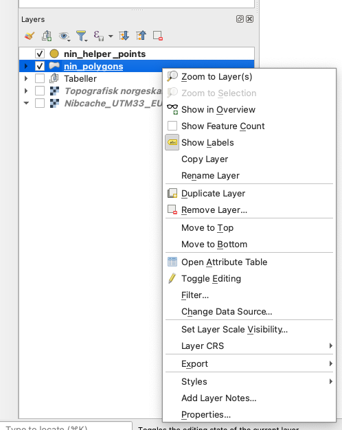
```

-   Høyreklikk på laget (`nin_polygons_<målestokk>`, f.eks. `nin_polygons_M005`) i laglisten.
-   Velg *Properties…* (Egenskaper) fra menyen.
-   I dialogen som åpnes, velg fanen *Fields* i venstremenyen.

Dette viser alle eksisterende attributtfelt i laget.

## Aktiver redigering av felt

```{r adv02, echo=FALSE}
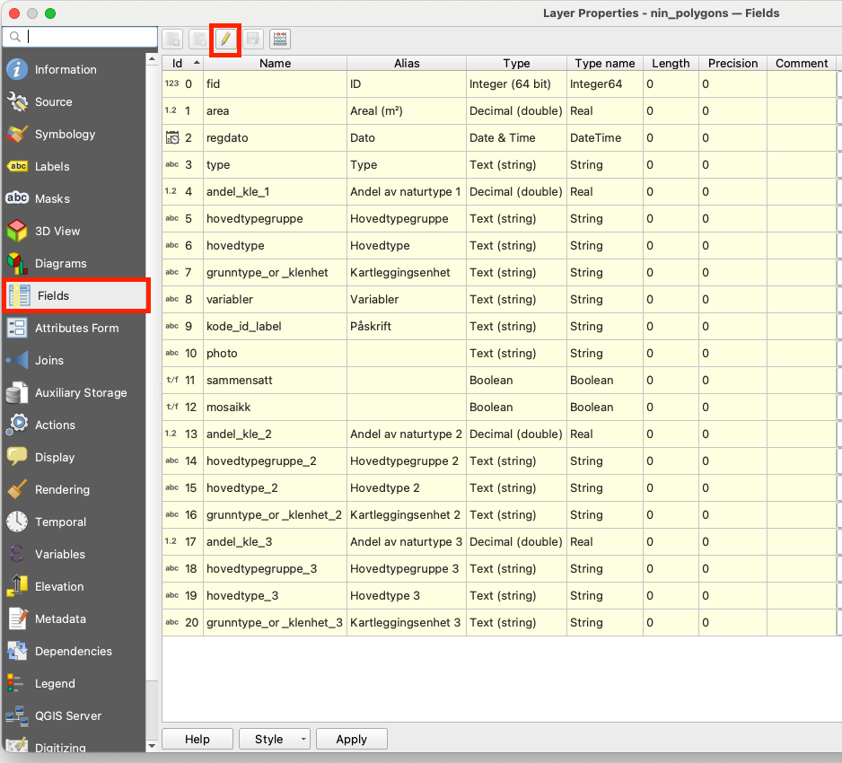
```

-   Klikk på blyant-ikonet øverst i feltlisten for å aktivere redigering av strukturen.
-   Når redigering er aktivert, kan du legge til, slette eller endre felt.

## Legg til nytt felt

```{r adv03, echo=FALSE}
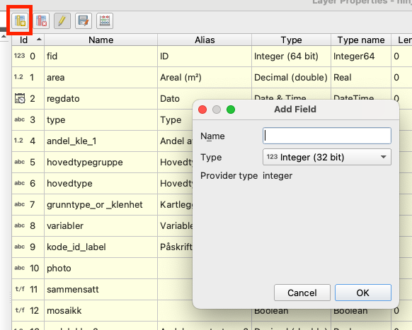
```

-   Klikk på ikonet *Legg til felt* (gult ark med grønt plusstegn).
-   Dialogen *Add Field* åpnes.

## Opprett feltet NVE_ID

```{r adv04, echo=FALSE}
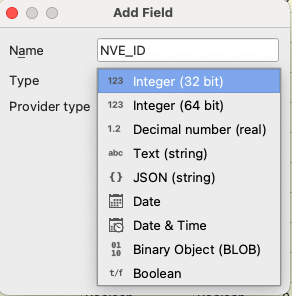
```

-   Skriv `NVE_ID` i feltet *Name*.
-   Velg datatype *Integer (32 bit)*.
-   Kontroller at *Provider type* settes automatisk til *integer*.
-   Klikk *OK* for å opprette feltet.

Dette feltet brukes til å lagre numerisk ID fra NVE.

## Opprett feltet firma

```{r adv05, echo=FALSE}
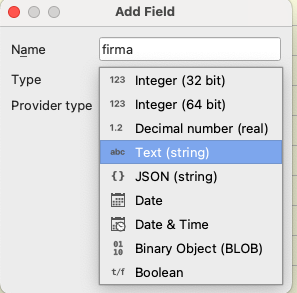
```

-   Klikk igjen på *Legg til felt*.
-   Skriv `firma` i *Name*.
-   Velg datatype *Text (string)*.

## Angi lengde for tekstfelt

```{r adv06, echo=FALSE}
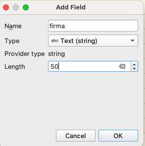
```

-   Når datatype er satt til tekst, angi *Length* = 50.
-   Klikk *OK* for å opprette feltet.

Dette bestemmer maksimal lengde på teksten som kan lagres i feltet.

## Kontroller at feltene er lagt til

```{r adv07, echo=FALSE}
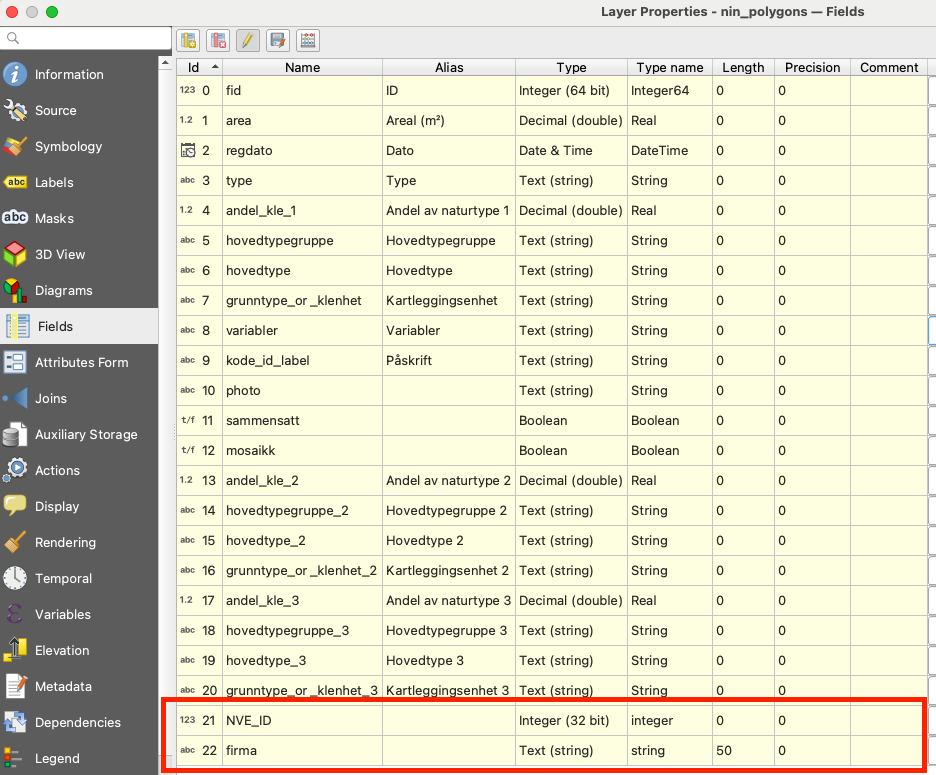
```

-   De nye feltene `NVE_ID` og `firma` vises nå nederst i feltlisten.
-   Klikk *Apply* eller *OK* for å lagre endringene i lagets struktur.

## Åpne fanen Attributes Form

```{r adv08, echo=FALSE}
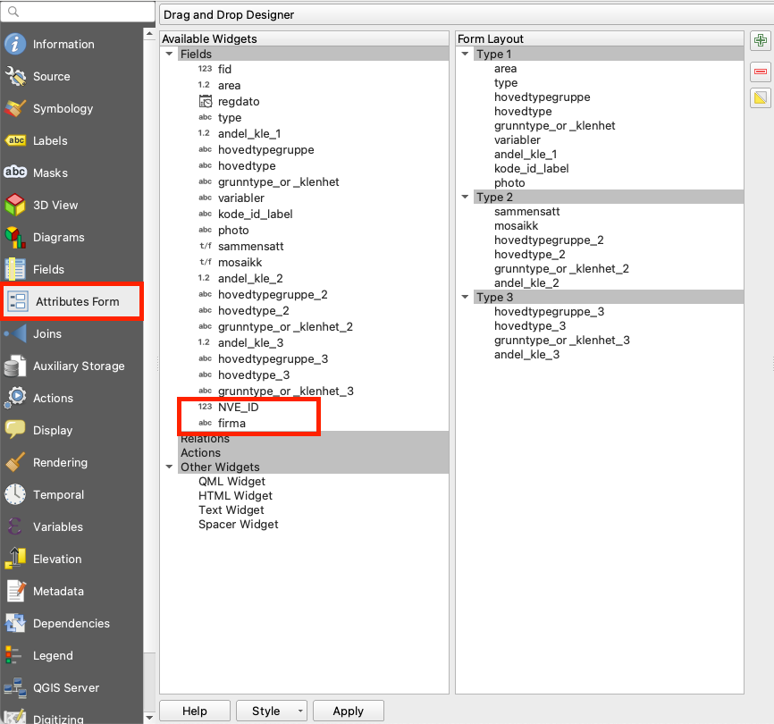
```

-   Gå til fanen *Attributes Form* i venstremenyen.
-   Her konfigureres hvordan redigeringsskjemaet for laget skal se ut.

## Flytt feltet NVE_ID inn i skjemaet

```{r adv09, echo=FALSE}
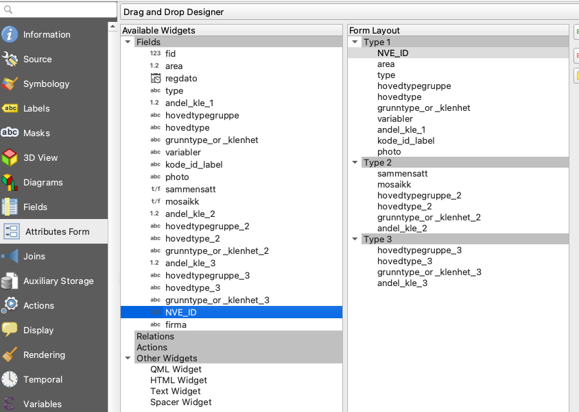
```

-   Finn feltet `NVE_ID` i listen *Available Widgets*.
-   Dra feltet over til ønsket plassering i *Form Layout* (for eksempel øverst under *Type 1*).

## Flytt feltet firma inn i skjemaet

```{r adv10, echo=FALSE}
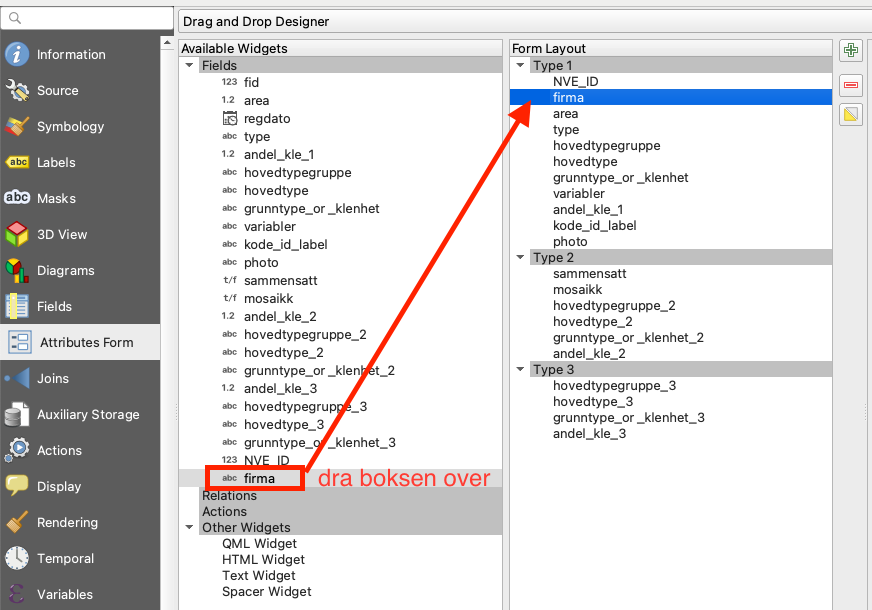
```

-   Finn feltet `firma` i *Available Widgets*.
-   Dra feltet til ønsket plassering i skjemaet, rett under `NVE_ID`.

## Lagre oppsettet

-   Klikk *Apply* eller *OK* for å lagre skjemaoppsettet.
-   Når du nå åpner attributtskjemaet for laget, vil feltene `NVE_ID` og `firma` vises i skjemaet.

## Sett felttype til Value Map

```{r adv11, echo=FALSE}
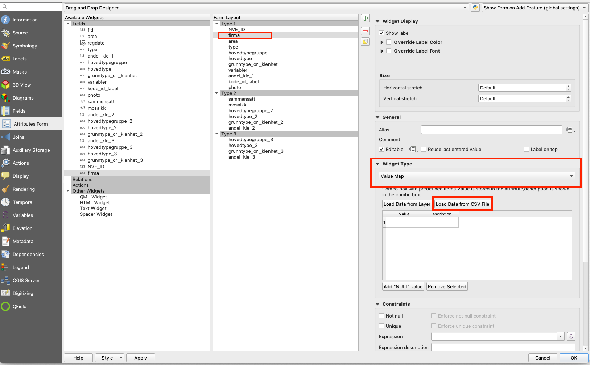
```

-   Marker feltet `firma` i *Form Layout*.
-   I høyre panel, under *Widget Type*, velg *Value Map*.
-   Dette gjør at feltet vises som en nedtrekksliste med forhåndsdefinerte verdier.

## Legg inn verdier i Value Map

```{r adv12, echo=FALSE}
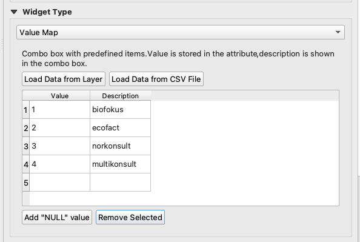
```

-   I tabellen under *Value* og *Description*, legg inn ønskede koder og visningsnavn:
    -   1 -- biofokus
    -   2 -- ecofact
    -   3 -- norkonsult
    -   4 -- multikonsult
-   Alternativt kan du bruke *Load Data from CSV File* hvis listen finnes i en fil.

Verdien i kolonnen *Value* lagres i databasen, mens *Description* vises i skjemaet.

## Kontroller skjemaet i redigeringsmodus

```{r adv13, echo=FALSE}
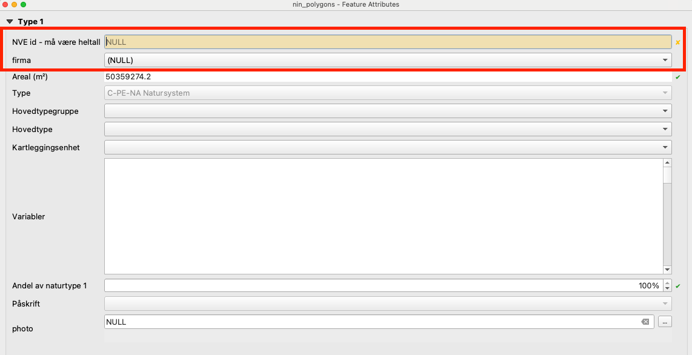
```

-   Åpne attributtskjemaet for en flate i laget.
-   Øverst i skjemaet vises nå feltene:
    -   *NVE id* -- må være heltall
    -   *firma* (som nedtrekksliste)

Dette bekrefter at både nye felt og skjemaoppsett fungerer korrekt.

## Velg verdi fra nedtrekkslisten

```{r adv14, echo=FALSE}
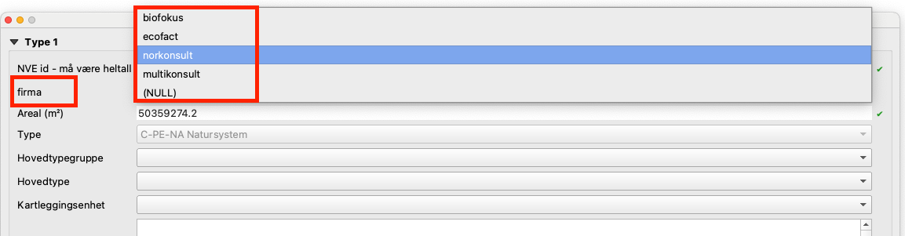
```

-   Klikk på nedtrekkslisten for feltet `firma`.
-   Velg ønsket firma fra listen (for eksempel norkonsult).
-   Verdien lagres automatisk når objektet lagres.

## Resultat

Du har nå:

-   Opprettet nye felt i attributtabellen.
-   Definert riktig datatype og lengde.
-   Lagt feltene inn i redigeringsskjemaet slik at de kan fylles ut ved digitalisering eller redigering.
-   Konfigurert feltet `firma` som en nedtrekksliste med forhåndsdefinerte verdier.

Husk at feltene bare finnes i dette prosjektets `.gpkg`-fil. Dersom du oppretter et nytt prosjekt med programtillegget, må feltene legges til på nytt.

`r if (knitr::is_html_output()) {
'
::: {style="display: flex; justify-content: space-between; margin-top: 3em;"}
<div> ← <a href="kvalitetssikring.html">Gå til forrige kapittel</a> </div>
<div> <a href="index.html">Gå til forsiden</a> → </div>
:::
'
} `
