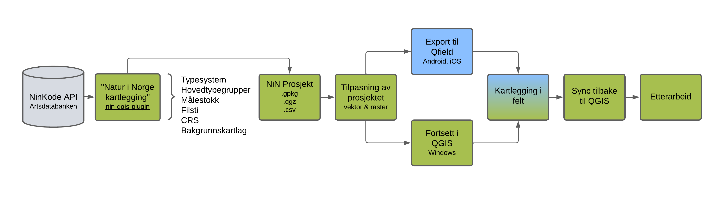

# Introduksjon {#introduksjon}

[Gå til GitHub-siden for programtillegget](https://github.com/geco-nhm/nin-qgis-plugin)

## Bakgrunn

I forbindelse med lanseringen av Natur i Norge (NiN) versjon 3.0 har vi utviklet programtillegget Natur i Norge kartlegging for QGIS. Hensikten er å forenkle, effektivisere og standardisere kartlegging etter NiN-systemet -- både i forarbeid, feltarbeid og etterarbeid.

Kartlegging etter dagens standard stiller økte krav til bruk av digitale verktøy, særlig når det gjelder innsamling, strukturering og kvalitetssikring av data. NiN 3.0 introduserer dessuten flere endringer og presiseringer i hvordan naturtyper skal beskrives og dokumenteres. Det stiller høyere krav til at arbeidsflyten er både enhetlig og faglig korrekt.

Programtillegget gjør det mulig å følge NiNs metodikk på en strukturert måte. Brukeren velger relevante spesifikasjoner som typesystem, målestokk og koordinatsystem, og programtillegget oppretter automatisk et QGIS-prosjekt med nødvendige kartlag og innstillinger. Det legges også til rette for eksport til QField slik at kartleggingen kan gjennomføres effektivt i felt.

## Formålet med veilederen

Denne veilederen er laget for fagpersoner som arbeider med kartlegging etter NiN-systemet, for eksempel i offentlig forvaltning, konsulentbransjen eller akademia. Veilederen forutsetter at brukeren har grunnleggende kompetanse i NiN-kartlegging.

Hensikten er å gi en praktisk innføring i bruken av programtillegget som benyttes til å forberede, gjennomføre og etterbehandle kartleggingsprosjekter i tråd med NiN-systemet. Arbeidsflyten inkluderer både bruk av QGIS og QField.

## Forutsetninger for bruk

Før du tar veilederen i bruk, må følgende være på plass:

-   QGIS (versjon 3.34 eller nyere) må være installert på enheten
-   QField må være installert på enheten som brukes til feltarbeid
-   Brukeren må ha grunnleggende kjennskap til NiN-systemet og kartleggingsprosessen

## Arbeidsflyt

#### QGIS -- forarbeid og etterarbeid {.unnumbered}

I denne veiledningen brukes QGIS på stasjonære datamaskiner eller bærbare PC-er uten berøringsskjerm til arbeid som vanligvis gjøres innendørs. Dette inkluderer:

-   Oppsett av kartleggingsprosjekt med programtillegget
-   Tilpasning av datasett og lag
-   Import og eksport av prosjekt
-   Kvalitetssikring etter feltarbeid

#### QField -- feltkartlegging {.unnumbered}

I denne veiledningen brukes QField på mobile enheter med berøringsskjerm, som nettbrett eller mobiltelefoner. Det er en fordel at enheten har innebygd GNSS-mottaker (aka GPS) for å sikre nøyaktig posisjonering. QField brukes her til feltarbeid og inkluderer:

-   Import og eksport av prosjekt
-   Registrering av polygoner og attributter
-   Bruk av enhetens kamera for dokumentasjon
-   Posisjonering med GPS

#### Fleksibel arbeidsflyt {.unnumbered}

Veilederen legger opp til en todelt arbeidsflyt med QGIS og QField, men det finnes flere muligheter:

-   Hele arbeidsflyten kan gjennomføres kun i QGIS hvis ønskelig
-   Enheter med eller uten berøringsskjerm kan brukes i alle faser
-   Både Windows og iOS kan brukes
-   Brukeren velger løsningen som passer best ut fra tilgjengelig utstyr og arbeidsforhold

Arbeidsflyten som er beskrevet i veilederen består av nedlastinv av Natur i Norge kartlegging, oppsett, tilrettelegging, eksport og import av prosjekt, kartlegging i felt og etterarbeid. Arbeid som utføres i QGIS er markert med grønt, mens arbeid som utføres i QField er markert med blått.

## Hva inneholder veilederen?

Veilederen gir deg innsikt i følgende:

-   Installering og oppsett av programtillegget i QGIS
-   Opprettelse og tilpasning av kartleggingsprosjekt
-   Eksport og import av prosjekt fra/til QGIS og QField
-   Registrering av naturtyper og tilhørende attributter i felt
-   Redigering av kartlag i QField
-   Praktiske tips for NiN-kartlegging
-   Import og etterarbeid av data i QGIS

## Nyttige lenker og ressurser

-   [Last ned QGIS](https://qgis.org)
-   [Hjelpeside for QGIS](https://docs.qgis.org/latest/en/docs/training_manual/index.html)
-   [QGIS programtilleggskatalog](https://plugins.qgis.org/plugins/nin_qgis_plugin/)
-   [Last ned QField](https://docs.qfield.org/get-started/)
-   [Hjelpeside for QField](https://docs.qfield.org/)
-   [Artsdatabanken -- Natur i Norge](https://naturinorge.artsdatabanken.no/)
-   [Systemdokumentasjon og kartleggingsveiledere -- Natur i Norge](https://artsdatabanken.no/Pages/345456)

::: {style="display: flex; justify-content: space-between; margin-top: 3em;"}

← <a href="index.html">Gå til forsiden</a>

<a href="feltutstyr.html">Gå til neste kapittel</a> →

:::
