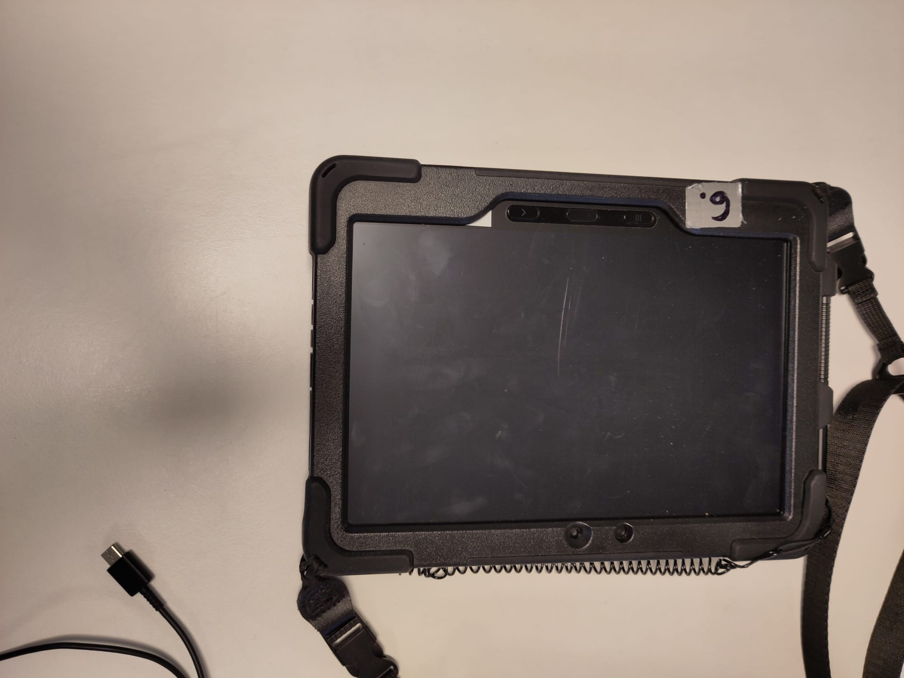
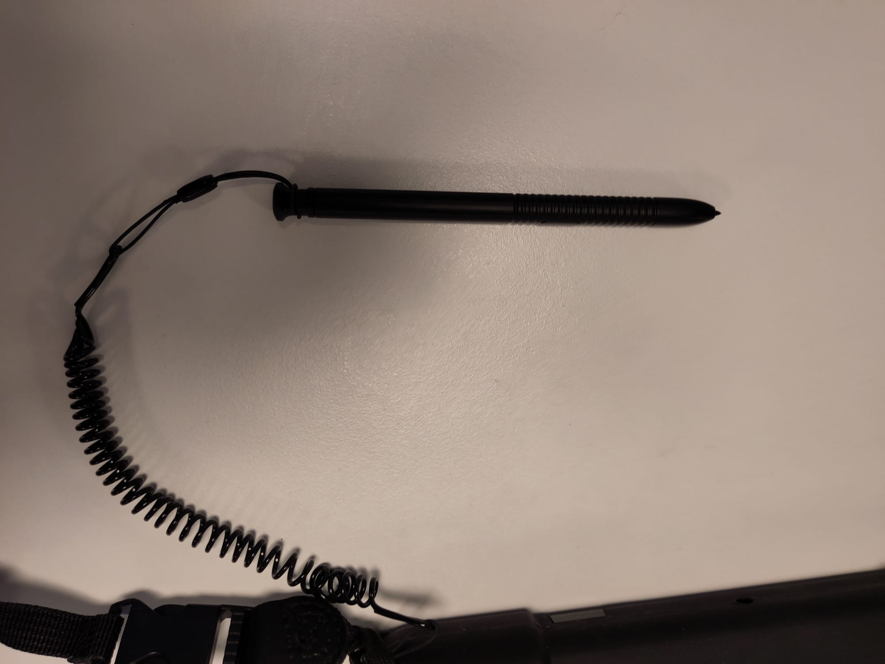
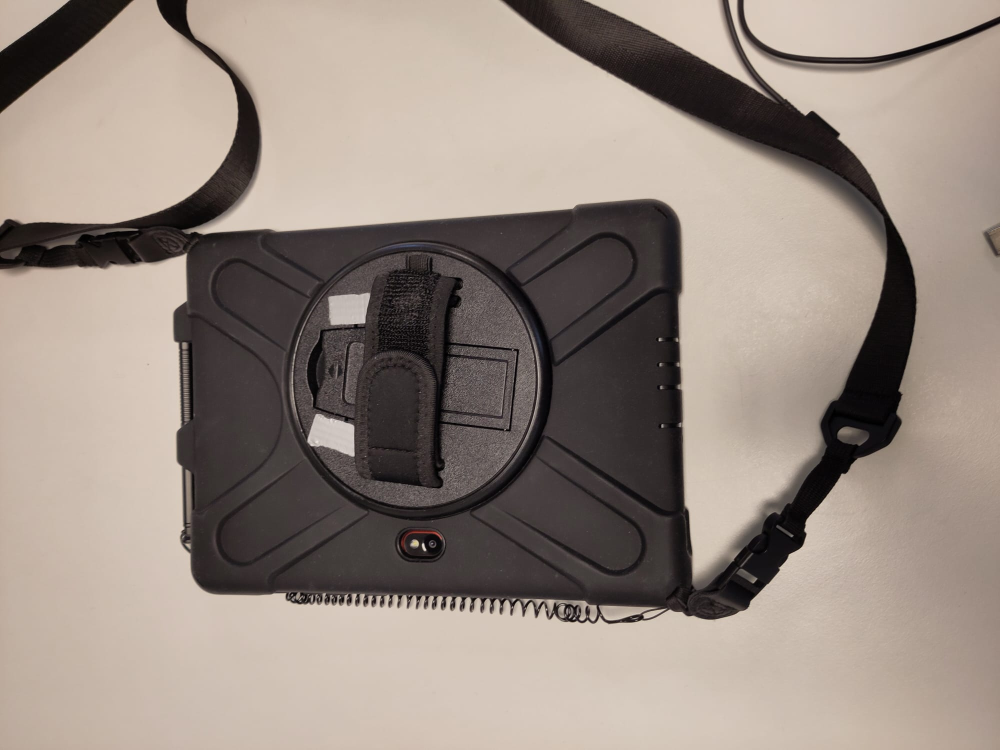
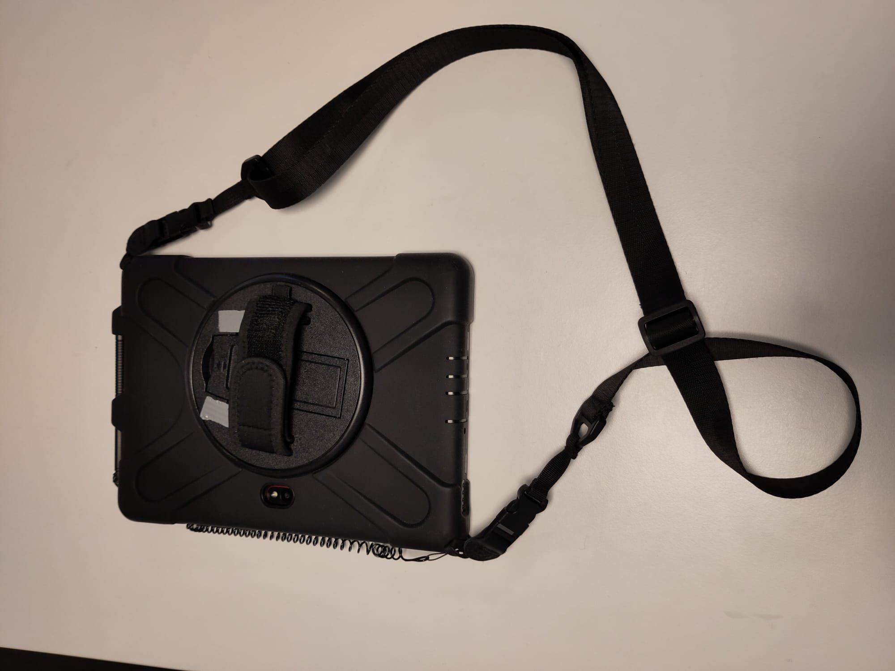
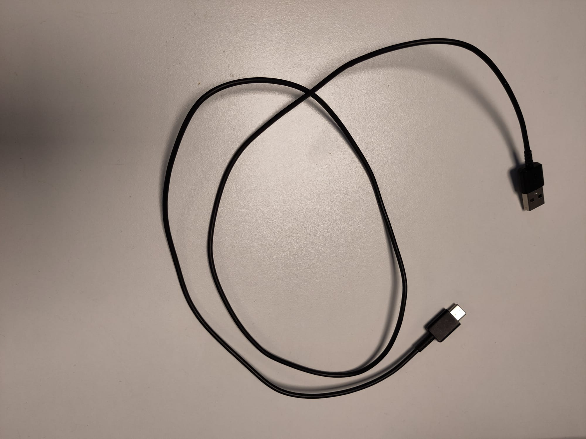

# Feltutstyr {#feltutstyr}

Vi anbefaler å bruke en håndholdt enhet med berøringsskjerm, digitaliseringspenn og innebygd GPS for feltkartlegging. For å kunne kvalitetssikre kartleggingen vil det også være fordelaktig om enheten har innebygd kamera. Dersom du ikke vil eksportere prosjektet til enheten gjennom QFieldCloud vil du også trenge en kabel som er kompatibel med både den stasjonære og håndholdte enheten. Det er mange enheter som oppfyller disse kriteriene. Vi bruker Samsung ... (se nedenfor), men det er også mulig å bruke andre typer nettbrett, mobiltelefoner, bærbare datamaskiner eller andre enheter. I veiledningen forklarer vi hvordan kartleggingen gjennomføres ved bruk av berøringsskjerm, men dersom du bruker en enhet uten berøringsskjerm vil du kunne utføre de samme operasjonene med datamus. I så fall vil venstreklikk og høyreklikk med datamus tilsvare klikk og langklikk med digitaliseringspennen.

Enheten er utstyrt med berøringsskjerm, digitaliseringspenn, kamera, håndtak og bæresele.

En kabel som er kompatibel med enheten kan brukes til å importere prosjektet.

::: {style="display: flex; justify-content: space-between; margin-top: 3em;"}

← <a href="introduksjon.html">Gå til forrige kapittel</a>

<a href="oppsett-og-tilrettelegging.html">Gå til neste kapittel</a> →

:::
