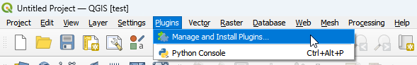
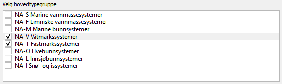

## 1 Oppsett og tilrettelegging {#oppsett-og-tilrettelegging}

Åpne QGIS (versjon 3.34 eller nyere).

### 1.1 Installer Plugin

Sørg for at du har tilgang på internett. Dette er nødvendig for å laste ned programtillegget.

#### 1.1.1 Gå til Plugins i menylinjen og klikk på [Manage and Install Plugins...]{style="background-color: #888888;"}

#### {width="1306"}

Det vil dukke opp et vindu.

#### 1.1.2 Installer "Natur i Norge kartlegging"

A. Søk etter "Natur i Norge kartlegging" i søkefeltet\
B. Klikk på "Natur i Norge kartlegging"\
C. Klikk på Install Plugin

Ikonet for "Natur i Norge"-kartlegging vil nå dukke opp i verktøymenyen.

### 1.2 Opprett prosjekt {#opprett-prosjekt}

#### 1.2.1 Klikk på ikonet for "Natur i Norge"-kartlegging

Det vil dukke opp et vindu med flere valgmuligheter.

#### 1.2.2 Velg kategorier som skal være tilgjengelige under kartleggingen

Et prosjekt kan kun inneholde ett typesystem, men det er mulig å velge flere hovedtypegrupper fra samme typesystem. Et prosjekt kan kun inneholde kategorier fra én kartleggingsmålestokk.

##### 1.2.2.1 Klikk på nedtrekksmenyen for å velge typesystem

##### 1.2.2.1 Velg én av typesystemene fra nedtrekksmenyen

##### 1.2.2.2 Huk av boks(er) for å velge hovedtypegruppe(r)

##### 

##### 1.2.2.3 Klikk på nedtrekksmenyen for å velge kartleggingsmålestokk

##### 

##### 1.2.2.3 Velg én kartleggingsmålestokk

**Kartleggingsmålestokker:**\
*grunntyper* - 1:500\
*M005* - 1:5000\
*M020* - 1:20 000\
*M050* - 1:50 000

#### 1.2.3 Huk av én av boksene for å velge koordinatsystem

Projeksjon av tredimensjonale data på todimensjonale flater vil alltid medføre forvrengninger. Graden av forvrengning varierer mellom ulike områder, avhengig av hvilket koordinatsystem som benyttes. Derfor bør koordinatsystemet velges ut fra hvor kartleggingen skal foregå.

#### 1.2.4 Velg hvor prosjektet skal lagres

##### 1.2.4.1 Klikk på ...

Det vil dukke opp et nytt vindu som lar deg navigere til mappen hvor du ønsker å lagre prosjektet.

##### 1.2.4.2 Navigér til mappen hvor du ønsker at prosjektet skal lagres

##### 

##### 1.2.4.2 Velg filnavn

A. Trykk på feltet File name: og skriv inn ønsket filnavn (f.eks. my_qgis_project)\
B. Klikk på Save

##### 

Du vil nå se filplasseringen i feltet.

#### 1.2.5 Velg ev. WMS/WMTS-lag

Topografiske kart og flybilder er viktige hjelpemidler under kartlegging. Her kan du velge hvilke(t) kartlag som skal importeres til prosjektet.

##### 1.2.5.1 Huk av boks(er) for å velge WMS/WMTS-lag

#### 1.2.6 Klikk på Lag geopackage-fil og forbered prosjekt nederst i vinduet

#### 

Et prosjekt med filnavnet "NiN_kartlegging.qgz" vil nå opprettes automatisk med den oppgitte filplasseringen. I tillegg vil det opprettes en gpkg-fil med kartlag og tabeller. Prosjektet med gpkg-filen kan igjen åpnes fra denne filplasseringen senere. Kartlagene vil åpnes med prosjektet med mindre gpkg-filen flyttes til et annet område. gpkg-filen inneholder følgende:

**Opprettede kartlag og tabeller:**\
*nin_helper_points* -- punktkartlag for å hjelpe kartleggeren i felt\
*nin_polygons* -- polygonkartlag for å registrere kartleggingsenheter i felt\
*Tabeller* -- tabeller som inneholder typene og variablene som brukes i typesystemene

**Importerte kartlag (avhengig av valgene i vinduet):**\
*Topografisk norgeskart* -- landsdekkende kart med høydekoter og hovedøkosystemer som farger\
*Topografisk norgeskart gråtone* -- landsdekkende kart med høydekoter og hovedøkosystemer i gråtoner\
*Nibcache_UTM32_EUREF89_v2* -- landsdekkende sammenstilte flybilder

### 1.3 Tilpass prosjekt {#tilpass-prosjekt}

#### 1.3.1 Legge til vektordata

Vektordata består av objekter med en gitt geometri -- punkt, linje eller polygon -- der hvert objekt representerer én verdi eller egenskap.

-   **Punkter** har en posisjon, men verken lengde eller areal. Et eksempel er artsobservasjoner, som kan være nyttige under naturtypekartlegging. Slike data kan lastes ned fra [Artsdatabanken](https://www.artsdatabanken.no).

-   **Linjer** registreres med hjørnekoordinater, har lengde, men ikke areal. Et eksempel er høydekoter, som gir informasjon om terreng og topografi. Topografiske forhold påvirker fuktighet, vindeksponering og solinnstråling -- faktorer som er avgjørende for naturtypers utbredelse. Høydekoter kan lastes ned fra [Kartverket](https://www.kartverket.no).

-   **Polygoner** har både lengde og areal. Et polygonkartlag over verneområder fra [Miljødirektoratet](https://www.miljodirektoratet.no) kan være nyttig, eller man kan lage egne polygonlag for å avgrense studieområdet.

Last ned relevante vektordata som `.shp`-filer (shapefiler) og lagre dem samlet i en mappe før du importerer dem til QGIS.

##### 1.3.1.1 Gå til Layer i menylinjen, deretter Add Layer, og klikk på Add Vector Layer...

Det vil nå dukke opp et vindu.

##### 1.3.1.2 Klikk på ...

##### 1.3.1.3 Naviger til mappen hvor vektorlaget er lagret

##### 

##### 1.3.1.4 Velg fil

A. Klikk på filen\
B. Klikk på Open

##### 1.3.1.5 Klikk på Add

Filen vil nå være lagt inn i prosjektet.

#### 1.3.2 Legge til rasterdata

Rasterdata består av et rutenett der hver rute (celle) har én verdi. Formatet brukes ofte for bilder og modellerte kart, og egner seg godt til visualisering av bakgrunnsdata.

-   **Flybilder** er viktige hjelpemidler i naturtypekartlegging. Dersom WMS-kartlaget som importeres via programtillegget har for lav oppløsning, kan det være nyttig å importere mer detaljerte flybilder manuelt. Historiske flyfoto kan også gi verdifull informasjon om tidligere landskapsbruk og endringer over tid. Slike bilder kan lastes ned fra [Norge i bilder](https://www.norgeibilder.no).

-   **Høydemodeller** er nyttige for å forstå terreng og topografiske forhold. En digital terrengmodell viser bakkenivå, mens en overflatemodell inkluderer objekter som bygninger og vegetasjon. Disse kan være nyttige for å skille mellom naturlige og menneskeskapte strukturer. Data kan lastes ned fra [Høydedata.no](https://hoydedata.no).

Last ned rasterdata som `.tif`-filer og lagre dem i en mappe før import i QGIS.

##### 1.3.2.1 Gå til Layer i menylinjen, deretter Add Layer, og klikk på Add Raster Layer...

Det vil nå dukke opp et vindu.

##### 1.3.2.2 Klikk på ...

##### 1.3.2.3 Naviger til mappen hvor rasterlaget er lagret

##### 

##### 1.3.2.4 Velg fil

A. Klikk på filen\
B. Klikk på Open

##### 1.3.2.5 Klikk på Add

Filen vil nå være lagt inn i prosjektet.

### [Neste kapittel](chapter_3_export.Rmd)
