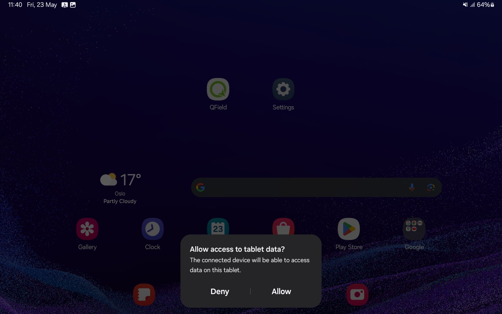
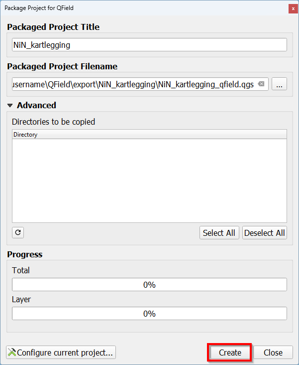
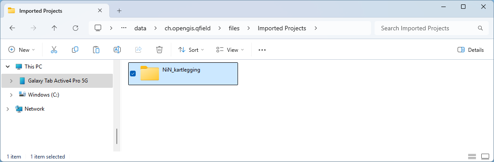

### 3 Eksportere prosjekt

For å eksportere prosjektet må programtillegget QFieldSync lastes ned. Prosjektet kan deretter eksporteres fra QGIS på en enhet til QField på en annen enhet ved hjelp av kabel eller via QField Cloud.

#### 3.1 Eksporter prosjekt ved hjelp av kabel

##### 3.1.3 Koble de to enhetene til hverandre med en kabel

Du vil nå få en melding på enheten med QField.

##### 3.1.3 Klikk på Allow 

##### 3.1.1 Klikk på ikonet for Configure Current Project

##### 3.1.2 Klikk på OK

##### 3.1.2 Klikk på ikonet for Package for QField

##### 3.1.3 Klikk på Create

##### 3.1.3 Åpne filutforsker og naviger til .... Høyreklikk deretter på prosjektmappen og klikk på Copy

##### 3.1.3 Åpne filutforsker og naviger til `This PC\Galaxy Tab Active4 Pro 5G\Internal storage\Android\data\ch.opengis.qfield\files\Imported Projects`. Høyreklikk deretter inni mappen of klikk på `Paste`

Prosjektet er nå klar til å åpnes på enheten med QField.

#### 3.2 Eksporter prosjektet gjennom QField Cloud

Dersom du ønsker å eksportere via QField Cloud må du opprette en konto på QField Cloud.

#### 3.2.1 Opprett konto for QField Cloud

##### 3.2.1.1 Gå til <https://app.qfield.cloud/accounts/login/> for å opprette konto for QField Cloud

##### 3.2.1.2 Klikk på Register for å registrere ny konto

##### 3.2.1.3 Fyll ut feltene for å opprette brukernavn, passord osv. Klikk til slutt på Register for å opprette konto

#### 3.2.2 Installer programtillegg i QGIS

Åpne QGIS og sørg for at du har tilgang på internett. Dette er nødvendig for å laste ned programtillegget.

#### 3.2.2.1 Gå til Plugins i menylinjen og klikk på `Manage and Install Plugins...`

{width="1306"}

Det vil dukke opp et vindu.

#### 3.2.2.2 Installer "QFieldSync"

A. Søk etter "QFieldSync" i søkefeltet\
B. Klikk på "QFieldSync"\
C. Klikk på Install Plugin

Ikonene for QFieldSync vil nå dukke opp i verktøymenyen.

### 3.2.3 Legg inn prosjekt i QField Cloud

#### 3.2.3.1 Klikk på ikonet for QField Cloud Project Overview

#### 3.2.3.2 Logg inn med QField Cloud

A. Fyll inn brukernavn og passord B. Klikk på Sign In

#### 3.2.3.3 Klikk på ikonet Start New Project

#### 3.2.3.4 Opprett et masterautentiseringspassord

A. Fyll inn midlertidig passord B. Klikk på Ok

#### 3.2.3.5 Velg innstillinger

A. Huk av for Convert currently open project to cloud project B. Klikk på Next

#### 3.2.3.5 Velg prosjektnavn og filplassering

A. Fyll inn prosjektnavn B. Beskriv prosjektet C. Angi ønsket filplassering

#### 3.2.3.5 Klikk på Create

#### 3.2.3.5 Klikk på OK

Prosjektet vil nå være eksportert til QField Cloud og det kan nå åpnes på den nye enheten.

### [Neste kapittel](chapter_3_mapping.Rmd)
