# Oppsett og tilrettelegging {#oppsett-og-tilrettelegging}

Åpne QGIS (versjon 3.34 eller nyere).

## Installer programtillegg

Sørg for at du har tilgang på internett. Dette er nødvendig for å laste ned programtillegget.

### Gå til `Plugins` i menylinjen og klikk på `Manage and Install Plugins...`


```{r index176, echo=FALSE}
knitr::include_graphics("images/install_plugin_1.png")
```


Det vil dukke opp et vindu.

### Installer `Natur i Norge kartlegging`

A. Søk etter "Natur i Norge kartlegging" i søkefeltet\
B. Klikk på `Natur i Norge kartlegging`\
C. Klikk på `Install Plugin`


```{r index177, echo=FALSE}
knitr::include_graphics("images/install_plugin_2.png")
```


Ikonet for `Natur i Norge kartlegging` vil nå dukke opp i verktøymenyen.


```{r index178, echo=FALSE}
knitr::include_graphics("images/toolbar_1.png")
```


## Opprett prosjekt {#opprett-prosjekt}

### Klikk på ikonet for `Natur i Norge kartlegging`


```{r index179, echo=FALSE, out.width='30pt', out.height='30pt'}
knitr::include_graphics("images/nin_toolbar_icon.png")
```


Det vil dukke opp et vindu med flere valgmuligheter.


```{r index180, echo=FALSE}
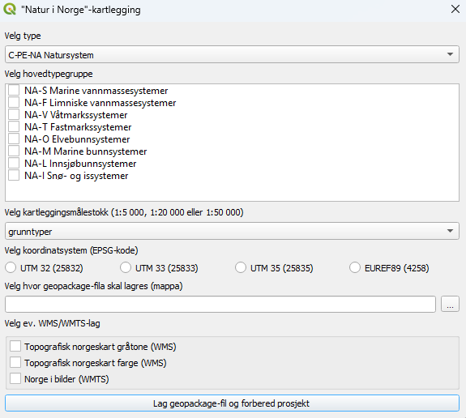
```


### Velg kategorier som skal være tilgjengelige under kartleggingen

Et prosjekt kan kun inneholde ett typesystem, men det er mulig å velge flere hovedtypegrupper fra samme typesystem. Et prosjekt kan kun inneholde kategorier fra én kartleggingsmålestokk.

#### Klikk på nedtrekksmenyen for å velge typesystem


```{r index181, echo=FALSE}
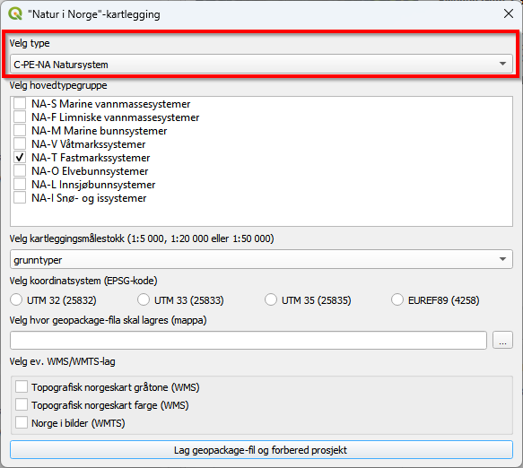
```


#### Velg én av typesystemene fra nedtrekksmenyen


```{r index182, echo=FALSE}
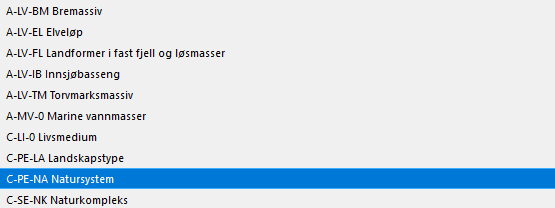
```


#### Huk av boks(er) for å velge hovedtypegruppe(r)


```{r index183, echo=FALSE}
knitr::include_graphics("images/select_major_type_group.png")
```


#### Klikk på nedtrekksmenyen for å velge kartleggingsmålestokk


```{r index184, echo=FALSE}
knitr::include_graphics("images/select_map_scale2.png")
```


#### Velg én kartleggingsmålestokk


```{r index185, echo=FALSE}
knitr::include_graphics("images/select_map_scale.png")
```


**Kartleggingsmålestokker:**\
*grunntyper* - 1:500\
*M005* - 1:5000\
*M020* - 1:20 000\
*M050* - 1:50 000

### Huk av én av boksene for å velge koordinatsystem

Man kan kartlegge i meter (UTM-sone) eller i geografiske koordinater (lengde- og breddegrad). Ønsker man UTM-koordinater, velger man sone (32, 33 eller 35) ut fra hvor kartleggingen skal foregå. Sone 32 inkluderer Sør-Norge t.o.m. Trøndelag. Sone 33 brukes for Nordland og Troms, mens sone 35 brukes for Finnmark.


```{r index186, echo=FALSE}
knitr::include_graphics("images/select_crs.png")
```


### Velg hvor prosjektet skal lagres

#### Klikk på `...`


```{r index187, echo=FALSE}
knitr::include_graphics("images/select_file_path2.png")
```


Det vil dukke opp et nytt vindu som lar deg navigere til mappen hvor du ønsker å lagre prosjektet.

#### Naviger til mappen hvor du ønsker at prosjektet skal lagres


```{r index188, echo=FALSE}
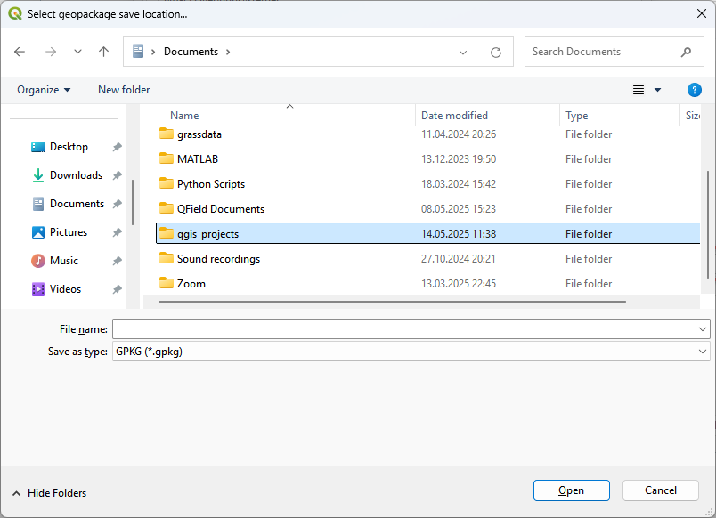
```


#### Velg filnavn

A. Klikk på feltet `File name:` og skriv inn ønsket filnavn (f.eks. my_qgis_project)\
B. Klikk på `Save`


```{r index189, echo=FALSE}
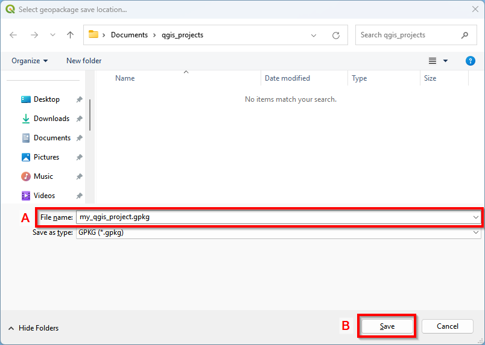
```


Du vil nå se filplasseringen i feltet.


```{r index190, echo=FALSE}
knitr::include_graphics("images/write_file_path.png")
```


### Velg ev. WMS/WMTS-lag

Topografiske kart og flybilder er viktige hjelpemidler under kartlegging. Her kan du velge hvilke(t) kartlag som skal importeres til prosjektet.

#### Huk av boks(er) for å velge WMS/WMTS-lag


```{r index191, echo=FALSE}
knitr::include_graphics("images/select_map_layers.png")
```


### Klikk på `Lag geopackage-fil og forbered prosjekt` nederst i vinduet


```{r index192, echo=FALSE}
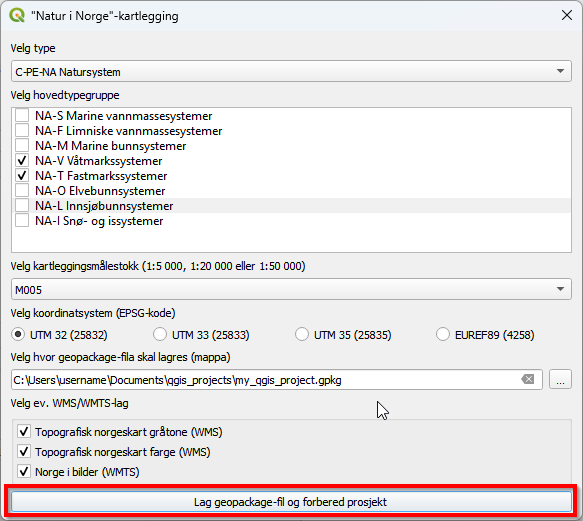
```


Et prosjekt med filnavnet `NiN_kartlegging.qgz` blir nå opprettet automatisk i den oppgitte filplasseringen. I tillegg vil det opprettes en `.gpkg-fil` med kartlag og tabeller. Prosjektet med `.gpkg-filen` kan igjen åpnes fra denne filplasseringen senere. Kartlagene vil åpnes med prosjektet med mindre `.gpkg-filen` flyttes til et annet område. `.gpkg-filen` inneholder følgende:


```{r index193, echo=FALSE}
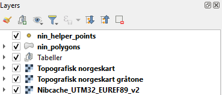
```


**Opprettede kartlag og tabeller:**\
*nin_helper_points* -- punktkartlag for å hjelpe kartleggeren i felt\
*nin_polygons* -- polygonkartlag for å registrere kartleggingsenheter i felt\
*Tabeller* -- tabeller som inneholder typene og variablene som brukes i typesystemene

**Importerte kartlag (avhengig av valgene i vinduet):**\
*Topografisk norgeskart* -- landsdekkende kart med høydekoter og hovedøkosystemer som farger\
*Topografisk norgeskart gråtone* -- landsdekkende kart med høydekoter og hovedøkosystemer i gråtoner\
*Nibcache_UTM32_EUREF89_v2* -- landsdekkende sammenstilte nyeste flybilder

## Tilpass prosjekt {#tilpass-prosjekt}

### Legge til vektordata

Vektordata består av objekter med en gitt geometri -- punkt, linje eller polygon -- der hvert objekt representerer én verdi eller egenskap.

-   **Punkter** har en posisjon, men verken lengde eller areal. Et eksempel er artsobservasjoner, som kan være nyttige under naturtypekartlegging. Dette kan lastes ned fra [Artsdatabanken](https://www.artsobservasjoner.no/)

-   **Linjer** registreres med hjørnekoordinater, har lengde, men ikke areal. Et eksempel er høydekoter, som gir informasjon om terrenget. Topografiske forhold påvirker fuktighet, vindeksponering og solinnstråling -- faktorer som er avgjørende for naturtypers utbredelse. Høydekurver fra N50 kan fritt lastes ned fra [geonorge](https://kartkatalog.geonorge.no/metadata/n50-kartdata/ea192681-d039-42ec-b1bc-f3ce04c189ac?search=n50). FKB-Høydekurve krever at man har brukernavn og passord.

-   **Polygoner** har både lengde og areal. Et polygonkartlag over verneområder fra kan være nyttig, eller man kan lage egne polygonlag for å avgrense studieområdet.

Relevante vektordata kan lastes ned fra [geonorge] (<https://www.geonorge.no>) hvor man kan taste inn navnet på datasettet man søker, f.eks. artsobs og vern. Da får man opp ei liste med tilgjengelige datasett. Enkelte datasett vil kreve innlogging (at man har brukernavn og passord). F.eks. er Høydekurver fra N50 fritt tilgjengelig fra [geonorge](https://kartkatalog.geonorge.no/metadata/n50-kartdata/ea192681-d039-42ec-b1bc-f3ce04c189ac?search=n50), mens FKB-Høydekurve krever innlogging. Lagre nedlasta data i ei mappe før du laster dem inn i QGIS.

#### 1.3.1.1 Gå til `Layer` → `Add Layer` i menylinjen og klikk på `Add Vector Layer...`


```{r index194, echo=FALSE}
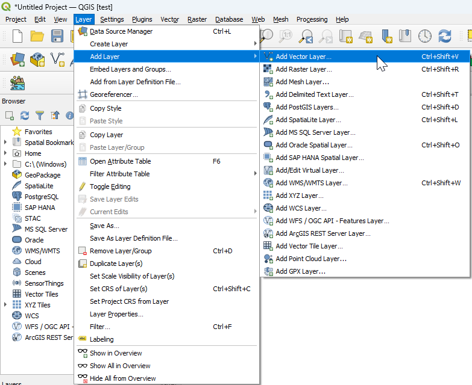
```


Det vil nå dukke opp et vindu.

#### Klikk på `...`


```{r index195, echo=FALSE}
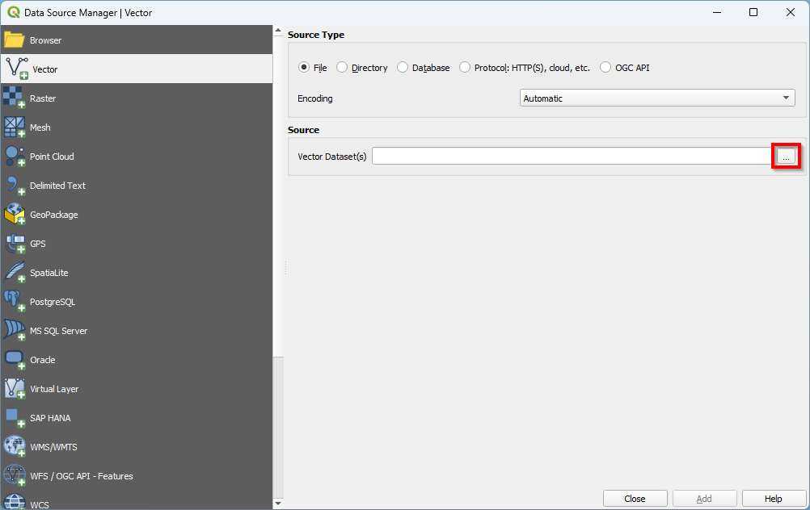
```


#### Naviger til mappen hvor vektorlaget er lagret


```{r index196, echo=FALSE}

```


#### Velg fil

A. Klikk på filen\
B. Klikk på `Open`


```{r index197, echo=FALSE}
knitr::include_graphics("images/add_vector3.png")
```


#### Klikk på `Add`


```{r index198, echo=FALSE}
knitr::include_graphics("images/add_vector4.png")
```


Filen vil nå være lagt inn i prosjektet.

### Legge til rasterdata

Rasterdata består av et rutenett der hver rute (celle) har én verdi. Formatet brukes ofte for bilder og modellerte kart, og egner seg godt til visualisering av bakgrunnsdata.

-   **Flybilder** er viktige hjelpemidler i naturtypekartlegging. Dersom du har tilgang på flybilder av høyere kvalitet enn det som er tilgjengelig i WMS-kartlaget som importeres via programtillegget, kan disse importeres manuelt. Historiske flyfoto kan også gi verdifull informasjon om tidligere landskapsbruk og endringer over tid. Flybilder kan lastes ned fra [Norge i bilder](https://www.norgeibilder.no/) om man har brukernavn og passord.

-   **Terrengmodeller** viser høyden på bakken over havet og er nyttige for å analysere terreng og topografiske forhold. **Overflatemodeller** inkluderer i tillegg bygninger, trær og annen vegetasjon som stikker opp fra bakken. Begge typer modeller kan lastes ned fra [Høydedata.no](https://www.hoydedata.no/).

Last ned rasterdata som `.tif` eller '.GeoTIFF'-filer og lagre dem i en mappe før import i QGIS.

#### Gå til `Layer` → `Add Layer` i menylinjen og klikk på `Add Raster Layer...`


```{r index199, echo=FALSE}
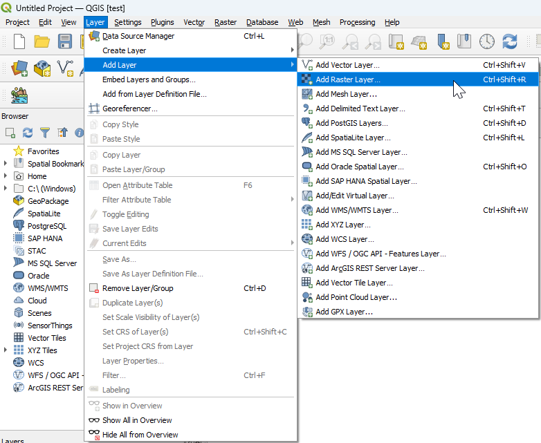
```


Det vil nå dukke opp et vindu.

#### Klikk på `...`


```{r index200, echo=FALSE}
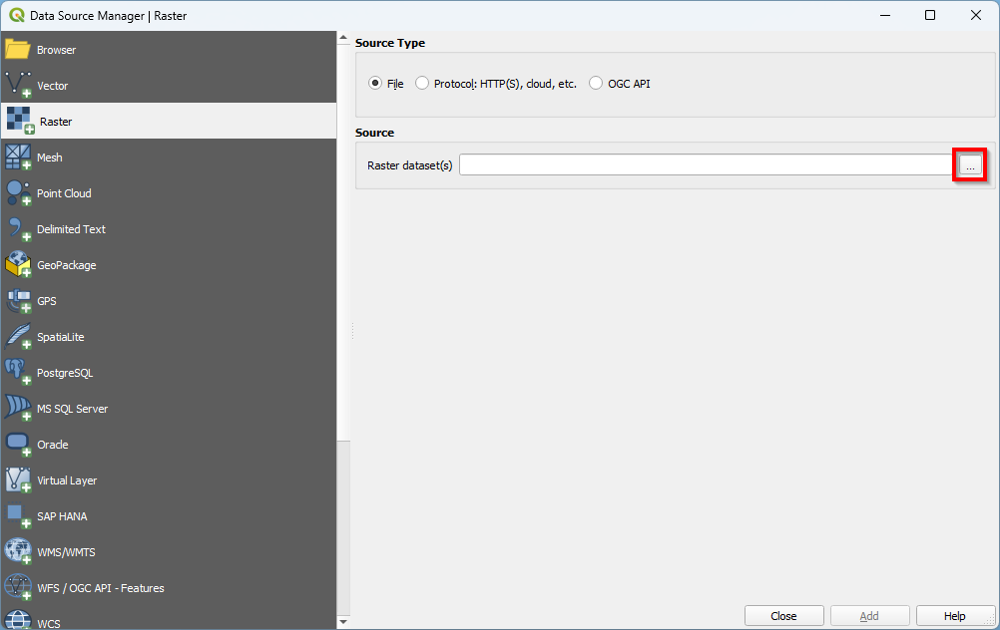
```


#### Naviger til mappen hvor rasterlaget er lagret


```{r index201, echo=FALSE}

```


#### Velg fil

A. Klikk på filen\
B. Klikk på `Open`


```{r index202, echo=FALSE}
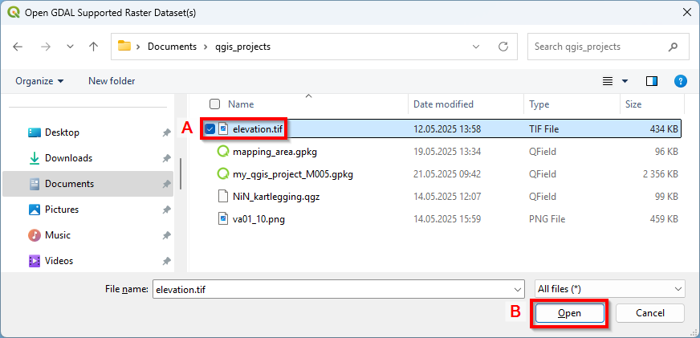
```


#### Klikk på `Add`


```{r index203, echo=FALSE}
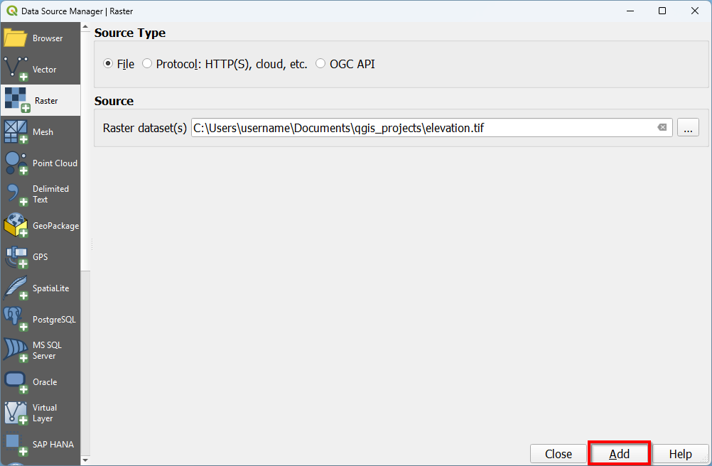
```


Filen vil nå være lagt inn i prosjektet.

`r if (knitr::is_html_output()) {
'
::: {style="display: flex; justify-content: space-between; margin-top: 3em;"}
<div> ← <a href="feltutstyr.html">Gå til forrige kapittel</a> </div>
<div> <a href="eksportere-prosjekt.html">Gå til neste kapittel</a> → </div>
:::
'
} `