# Eksportere og importeree prosjekt {#eksportere-prosjekt}

For å eksportere prosjektet må programtillegget QFieldSync lastes ned. Prosjektet kan deretter eksporteres fra QGIS på én enhet til QField på en annen enhet ved hjelp av kabel eller via QFieldCloud.

## Eksporter prosjekt ved hjelp av kabel

### Koble de to enhetene sammen med en kabel

Du vil nå få en melding på enheten med QField.

### Klikk på `Allow`

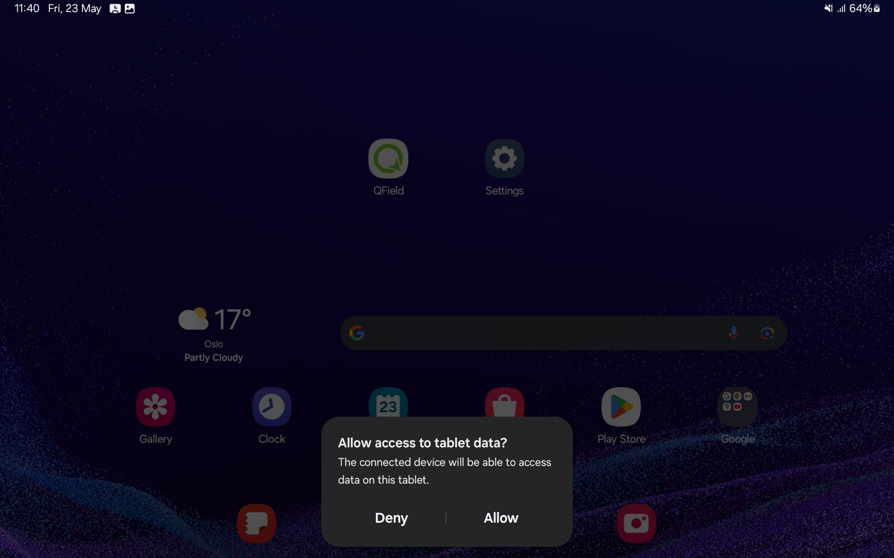

### Klikk på ikonet for `Configure Current Project`

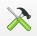

### Klikk på `OK`

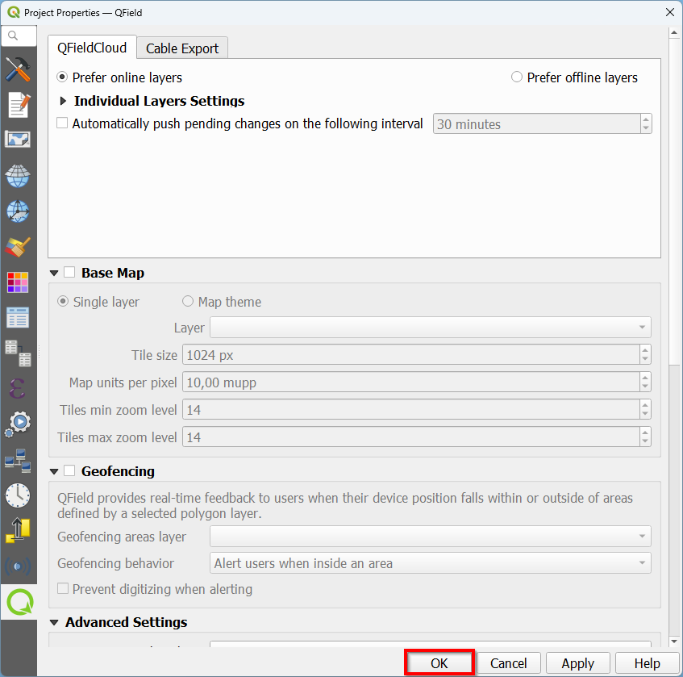

### Klikk på ikonet for `Package for QField`

### Klikk på `Create`

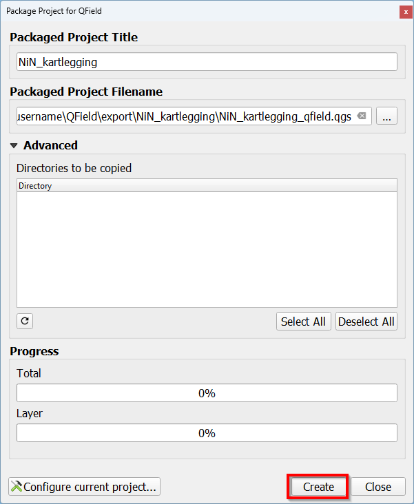

### Åpne filutforsker og naviger til `C:\Users\username\QField\export`. Høyreklikk deretter på prosjektmappen og klikk på `Copy`

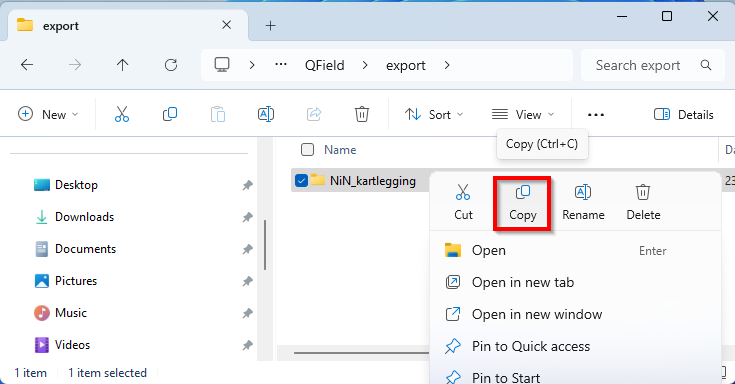

### Åpne filutforsker og naviger til `This PC\Galaxy Tab Active4 Pro 5G\Internal storage\Android\data\ch.opengis.qfield\files\Imported Projects`. Høyreklikk deretter inni mappen of klikk på `Paste`

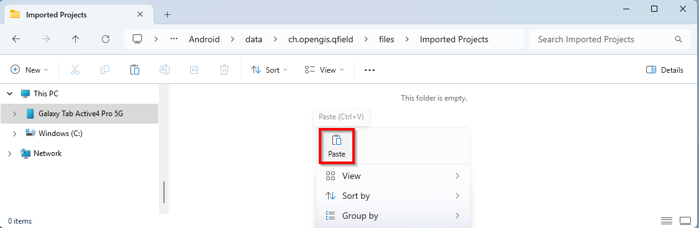

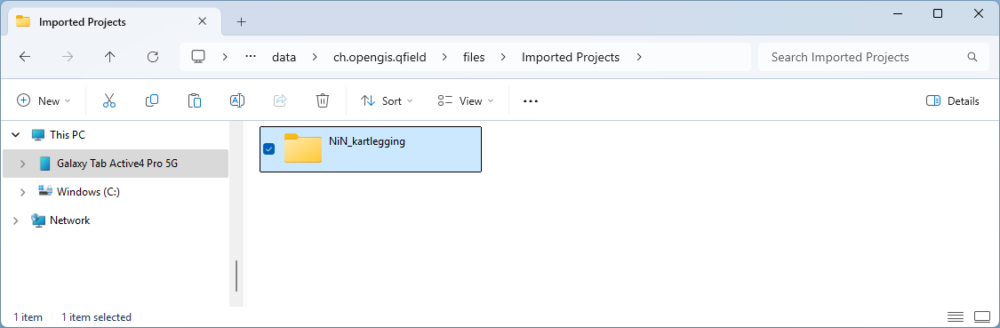

Prosjektet er nå klar til å åpnes på enheten med QField.

## Importer prosjekt ved hjelp av kabel

Man kan også importere prosjektet fra QField til QGIS. Først må du sørge for at enhetene er koblet sammen via kabelen.

### Klikk på ikonet for `Synchronize Project`

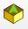

### Klikk på `...`

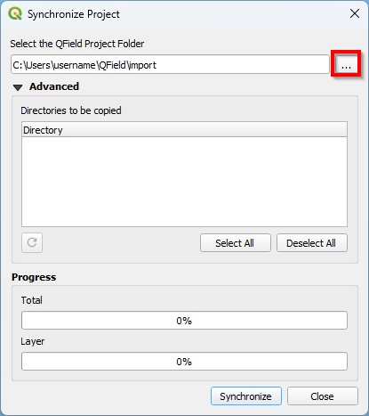

### Naviger til `This PC\Galaxy Tab Active4 Pro 5G\Internal storage\Android\data\ch.opengis.qfield\files\Imported Projects`.

A. Klikk på NiN_kartlegging og deretter på\
B. Klikk på `Select folder`

Skjermbilde

### Klikk på `Synchronize`

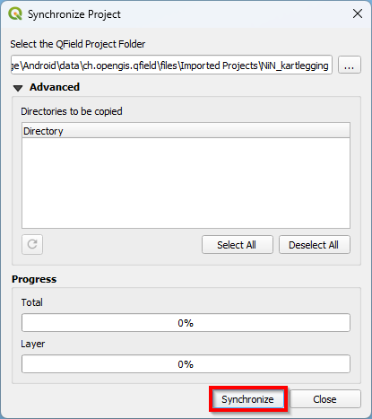

Prosjektet vil nå importeres i QGIS.

## Eksporter prosjektet gjennom QFieldCloud

Dersom du ønsker å eksportere via QFieldCloud må du opprette en konto på QFieldCloud.

## Opprett konto for QFieldCloud

### Gå til [innloggingssiden](https://app.qfield.cloud/accounts/login/) for å opprette konto for QFieldCloud

### Klikk på `Register` for å registrere ny konto

### Fyll ut feltene for å opprette brukernavn, passord, osv. Klikk til slutt på `Register` for å opprette konto

## Installer programtillegg i QGIS

Åpne QGIS og sørg for at du har tilgang på internett. Dette er nødvendig for å laste ned programtillegget.

## Gå til `Plugins` i menylinjen og klikk på `Manage and Install Plugins...`

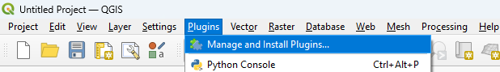

Det vil dukke opp et vindu.

## Installer QFieldSync

A. Søk etter "QFieldSync" i søkefeltet\
B. Klikk på `QFieldSync`\
C. Klikk på `Install Plugin`

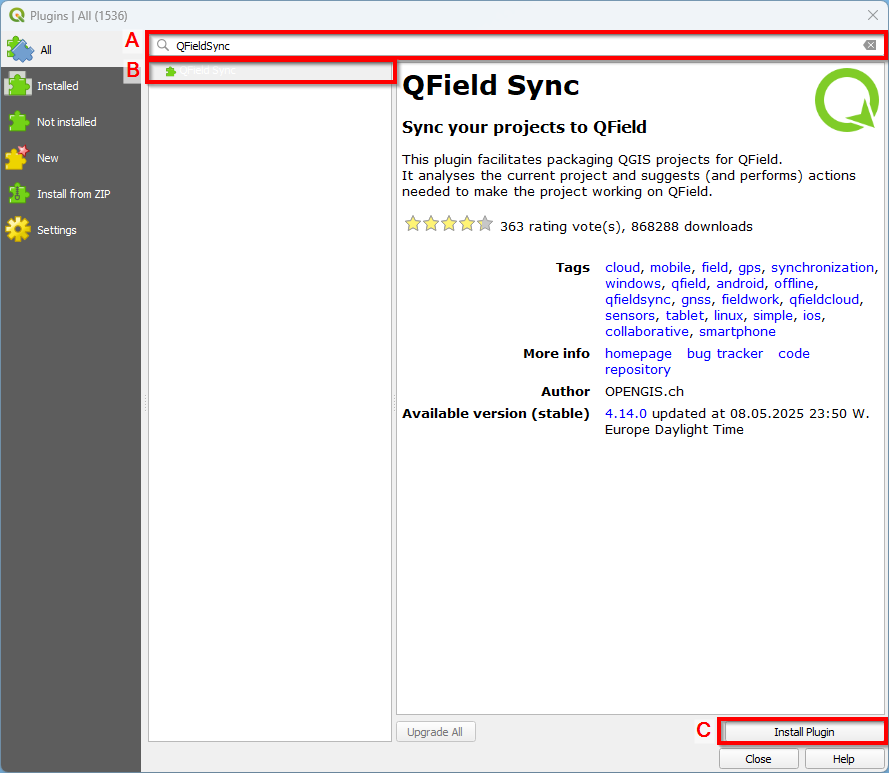

Ikonene for QFieldSync vil nå dukke opp i verktøymenyen.

## Legg inn prosjekt i QFieldCloud {#import-qfieldcloud}

### Klikk på ikonet for `QFieldCloud Projects Overview`

### Logg inn med QFieldCloud

A. Fyll inn brukernavn og passord\
B. Klikk på `Sign In`

### Klikk på ikonet `Start New Project`

### Opprett et midlertidig passord

A. Fyll inn midlertidig passord\
B. Klikk på `Ok`

### Velg innstillinger

A. Huk av for `Convert currently open project to cloud project`\
B. Klikk på `Next`

### Velg prosjektnavn og filplassering

A. Fyll inn prosjektnavn\
B. Beskriv prosjektet kort\
C. Angi ønsket filplassering

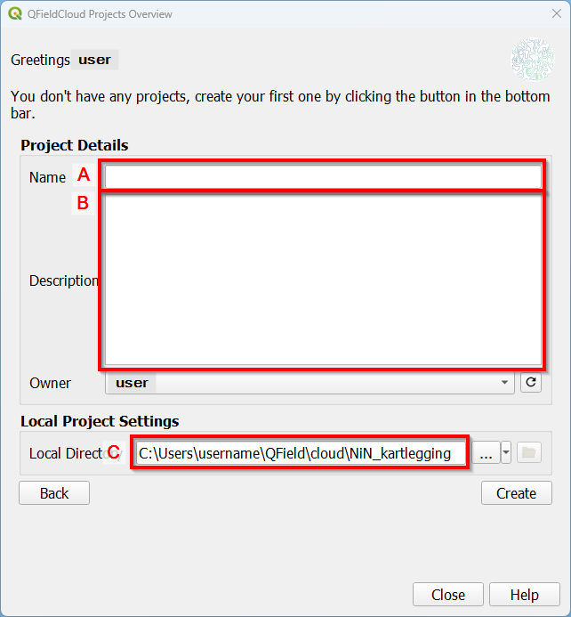

### Klikk på `Create`

### Klikk på `OK`

Prosjektet vil nå være eksportert til QFieldCloud og det kan nå åpnes på den nye enheten.

## Importer prosjektet gjennom QFieldCloud

Før du kan importere prosjektet i QGIS må du sørge for at endringene som er gjort i QField, er lastet opp til QFieldCloud (se \@ref(import-qfieldcloud) [Legg inn prosjekt i QFieldCloud](#import-qfieldcloud)). Import av prosjektet til QGIS er kun mulig med internett-tilgang.

### Klikk på ikonet for QFieldCloud Projects Overview

### Logg inn med QFieldCloud

A. Fyll inn brukernavn og passord\
B. Klikk på `Sign In`

### Klikk på prosjektet (my_cloud_project)

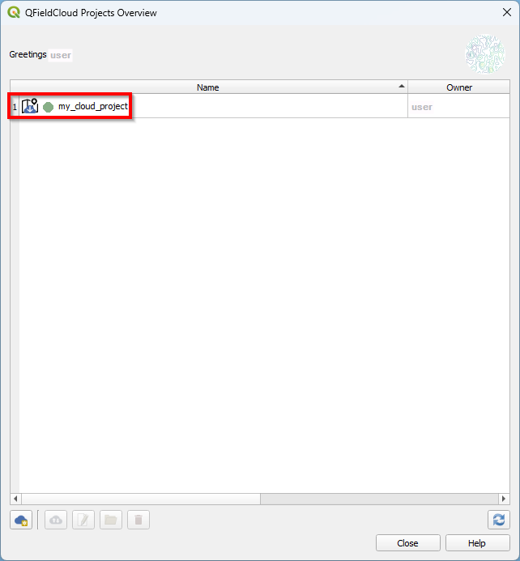

### Klikk på `Synchronize Selected Cloud Project`

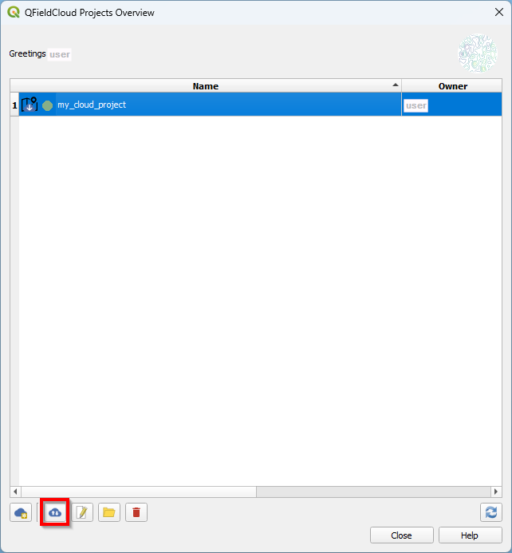

Det vil nå dukke opp et nytt vindu.

### Klikk på `Prefer Cloud`

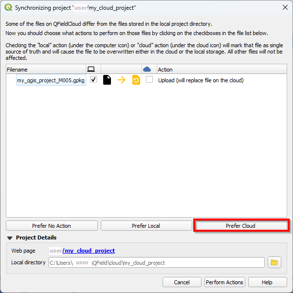

### Klikk på `Perform Actions`

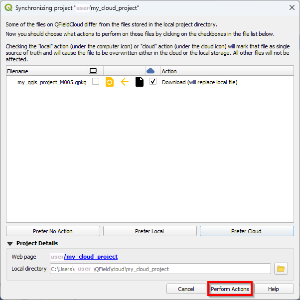

### Klikk på `OK`

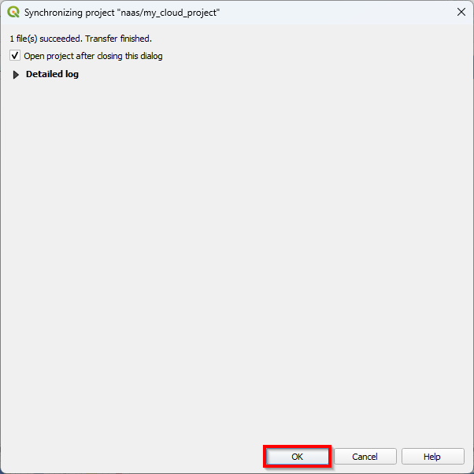

Prosjektet vil nå bli lastet ned fra skya og bli åpnet i QGIS.

::: {style="display: flex; justify-content: space-between; margin-top: 3em;"}

← <a href="oppsett-og-tilrettelegging.html">Gå til forrige kapittel</a>

<a href="kartlegging.html">Gå til neste kapittel</a> →

:::
