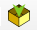
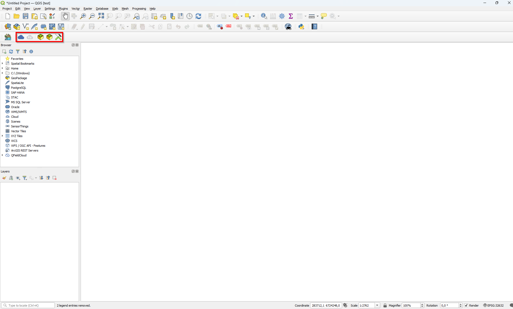
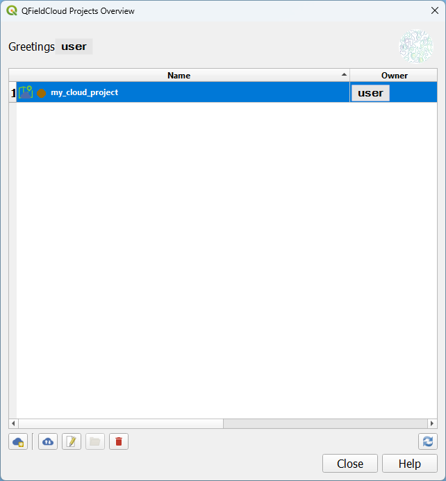

# Eksportere prosjekt

For å eksportere prosjektet må programtillegget QFieldSync lastes ned. Prosjektet kan deretter eksporteres fra QGIS på en enhet til QField på en annen enhet ved hjelp av kabel eller via QField Cloud.

## Eksporter prosjekt ved hjelp av kabel

### Koble de to enhetene sammen med en kabel

Du vil nå få en melding på enheten med QField.

### Klikk på `Allow`

### Klikk på ikonet for `Configure Current Project`

### Klikk på `OK`

### Klikk på ikonet for `Package for QField`

### Klikk på `Create`

### Åpne filutforsker og naviger til `C:\Users\username\QField\export`. Høyreklikk deretter på prosjektmappen og klikk på `Copy`

### Åpne filutforsker og naviger til `This PC\Galaxy Tab Active4 Pro 5G\Internal storage\Android\data\ch.opengis.qfield\files\Imported Projects`. Høyreklikk deretter inni mappen of klikk på `Paste`

Prosjektet er nå klar til å åpnes på enheten med QField.

## Importer prosjekt ved hjelp av kabel

På samme måte er det mulig å importere prosjektet i QGIS. Først må du sørge for at enhetene er koblet sammen.

### Klikk på ikonet for `Synchronize Project`

### Klikk på `...`

### Naviger til `This PC\Galaxy Tab Active4 Pro 5G\Internal storage\Android\data\ch.opengis.qfield\files\Imported Projects`.

A. Klikk på NiN_kartlegging og deretter på\
B. Klikk på `Select folder`

Skjermbilde

### Klikk på` Synchronize`

Prosjektet vil nå importeres i QGIS.

## Eksporter prosjektet gjennom QField Cloud

Dersom du ønsker å eksportere via QField Cloud må du opprette en konto på QField Cloud.

## Opprett konto for QField Cloud

### Gå til <https://app.qfield.cloud/accounts/login/> for å opprette konto for QField Cloud

### Klikk på `Register` for å registrere ny konto

### Fyll ut feltene for å opprette brukernavn, passord osv. Klikk til slutt på `Register` for å opprette konto

## Installer programtillegg i QGIS

Åpne QGIS og sørg for at du har tilgang på internett. Dette er nødvendig for å laste ned programtillegget.

## Gå til `Plugins` i menylinjen og klikk på `Manage and Install Plugins...`

{width="1306"}

Det vil dukke opp et vindu.

## Installer QFieldSync

A. Søk etter "QFieldSync" i søkefeltet\
B. Klikk på QFieldSync\
C. Klikk på `Install Plugin`

Ikonene for QFieldSync vil nå dukke opp i verktøymenyen.

## Legg inn prosjekt i QField Cloud

### Klikk på ikonet for `QField Cloud Project Overview`

### Logg inn med QField Cloud

A. Fyll inn brukernavn og passord 
B. Klikk på `Sign In`

###  Klikk på ikonet `Start New Project`

### Opprett et midlertidig passord

A. Fyll inn midlertidig passord 
B. Klikk på `Ok`

### Velg innstillinger

A. Huk av for `Convert currently open project to cloud project`
B. Klikk på `Next`

### Velg prosjektnavn og filplassering

A. Fyll inn prosjektnavn 
B. Beskriv prosjektet kort 
C. Angi ønsket filplassering

### Klikk på `Create`

### Klikk på `OK`

Prosjektet vil nå være eksportert til QField Cloud og det kan nå åpnes på den nye enheten.

## Importer prosjektet gjennom QField Cloud

Før du kan importere prosjektet i QGIS må du sørge for at endringene som er gjort i QField er lastet opp til QField Cloud (se del ...). Importering av prosjektet i QGIS er kun mulig med internett-tilgang.

### Klikk på ikonet for QField Cloud Project Overview

### Logg inn med QField Cloud

A. Fyll inn brukernavn og passord 
B. Klikk på `Sign In`

### Klikk på prosjektet (my_cloud_project)

### Klikk på `Synchronize Selected Cloud Project`

Det vil nå dukke opp et nytt vindu.

### Klikk på `Prefer Cloud`

### Klikk på `Perform Actions`

### Klikk på `OK`

Endringene vil nå synkroniseres og prosjektet vil åpnes i QGIS.

[Neste kapittel](chapter_5_mapping.Rmd)
