# Eksportere og importere prosjekt {#eksportere-prosjekt}

For å eksportere prosjektet må programtillegget QFieldSync lastes ned. Prosjektet kan deretter eksporteres fra QGIS på én enhet til QField på en annen enhet ved hjelp av kabel eller via QFieldCloud.

## Eksporter prosjekt ved hjelp av kabel

### Koble de to enhetene sammen med en kabel

Du vil nå få en melding på enheten med QField.

### Klikk på `Allow`

```{r index204, echo=FALSE}
knitr::include_graphics("images/cable_export9.jpg")
```

### Klikk på ikonet for `Configure Current Project`

```{r index205, echo=FALSE, out.width='30pt', out.height='30pt'}
knitr::include_graphics("images/cable_export4.png")
```

### Klikk på `OK`

```{r index206, echo=FALSE}
knitr::include_graphics("images/cable_export2.png")
```

### Klikk på ikonet for `Package for QField`

```{r index207, echo=FALSE, out.width='30pt', out.height='30pt'}
knitr::include_graphics("images/cable_export5.png")
```

### Klikk på `Create`

```{r index208, echo=FALSE}
knitr::include_graphics("images/cable_export3.png")
```

### Åpne filutforsker og naviger til `C:\Users\username\QField\export`. Høyreklikk deretter på prosjektmappen og klikk på `Copy`

```{r index209, echo=FALSE}
knitr::include_graphics("images/cable_export6.png")
```

### Åpne filutforsker og naviger til `This PC\Galaxy Tab Active4 Pro 5G\Internal storage\Android\data\ch.opengis.qfield\files\Imported Projects`. Høyreklikk deretter inni mappen of klikk på `Paste`

```{r index210, echo=FALSE}

```

```{r index211, echo=FALSE}
knitr::include_graphics("images/cable_export8.png")
```

Prosjektet er nå klar til å åpnes på enheten med QField.

## Importer prosjekt ved hjelp av kabel

Man kan også importere prosjektet fra QField til QGIS. Først må du sørge for at enhetene er koblet sammen via kabelen. Deretter må du flytte filen fra filsystemet på enheten som bruker QField til enheten som bruker QGIS. Merk at de påfølgende trinnene gjøres på enheten som bruker QGIS, gjerne en laptop.

### Åpne filutforsker

### Naviger til `This PC\Galaxy Tab Active4 Pro 5G\Internal storage\Android\data\ch.opengis.qfield\files\Imported Projects`

### Høyreklikk på `NiN_kartlegging` og klikk på `Copy`

```{r indexnew1, echo=FALSE}
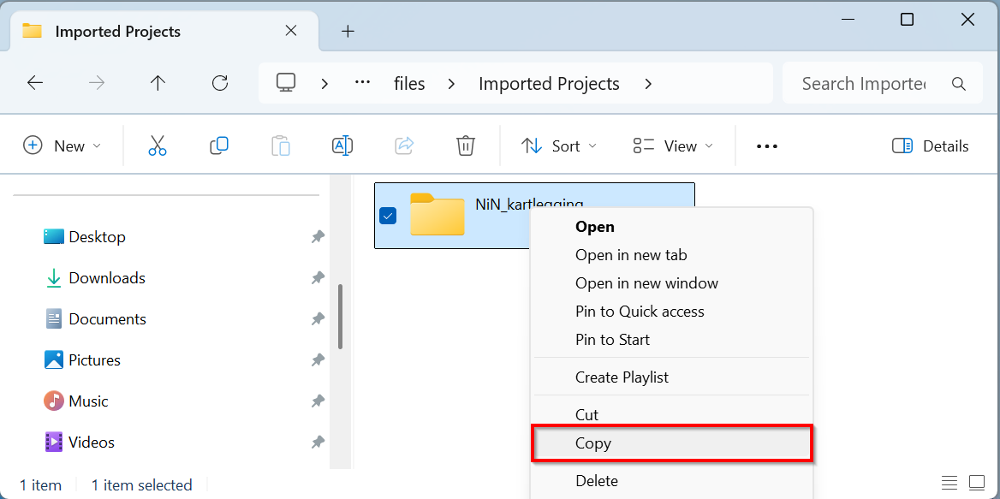
```

### Naviger til `This PC\username\QField\export`

### Høyreklikk inni mappen og klikk på `Paste`

```{r indexnew2, echo=FALSE}
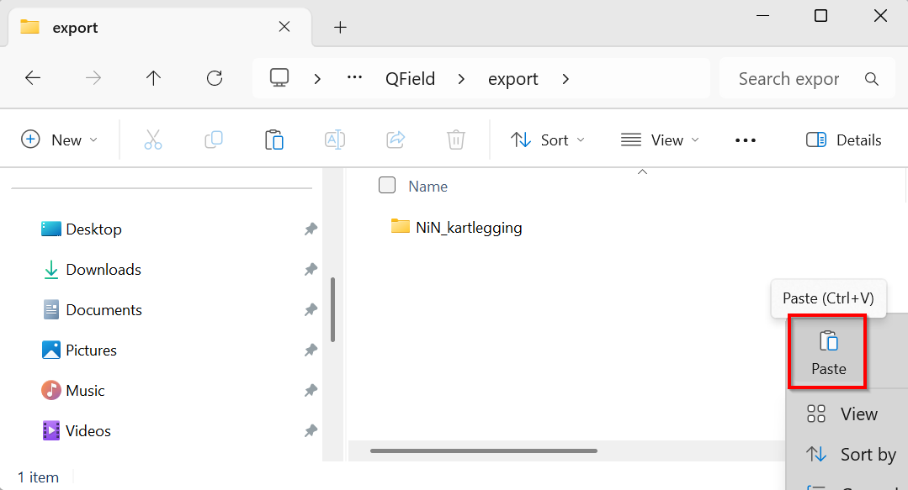
```

### Klikk på `Yes`. Du kan eventuelt lage en backup før du overskriver.

```{r indexnew3, echo=FALSE}
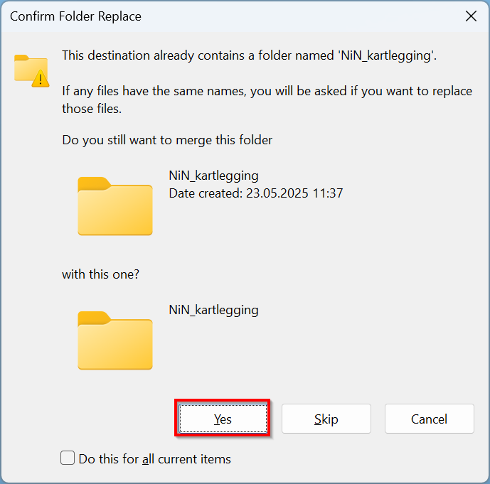
```

Gå deretter tilbake til QGIS.

### Klikk på ikonet for `Synchronize Project`

```{r index212, echo=FALSE, out.width='30pt', out.height='30pt'}
knitr::include_graphics("images/import.png")
```

### Klikk på `...`

```{r index213, echo=FALSE}
knitr::include_graphics("images/import2.png")
```

### Naviger til `This PC\username\QField\export`

A. Klikk på `NiN_kartlegging`\
B. Klikk `Select folder`

```{r indexnew4, echo=FALSE}
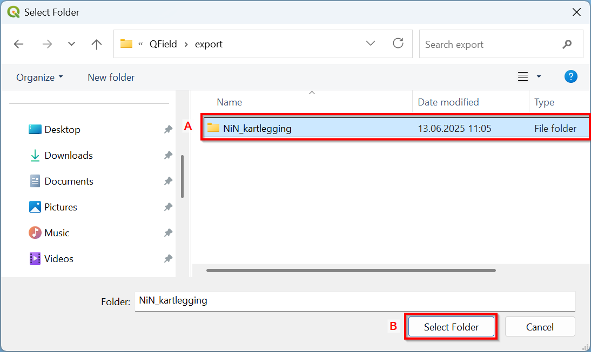
```

### Klikk på `Synchronize`

```{r index214, echo=FALSE}
knitr::include_graphics("images/import3.png")
```

Prosjektet vil nå importeres i QGIS.

## Eksporter prosjektet gjennom QFieldCloud

Dersom du ønsker å eksportere via QFieldCloud må du opprette en konto på QFieldCloud.

## Opprett konto for QFieldCloud

### Gå til [innloggingssiden](https://app.qfield.cloud/accounts/login/) for å opprette konto for QFieldCloud

### Klikk på `Register` for å registrere ny konto

```{r index215, echo=FALSE}
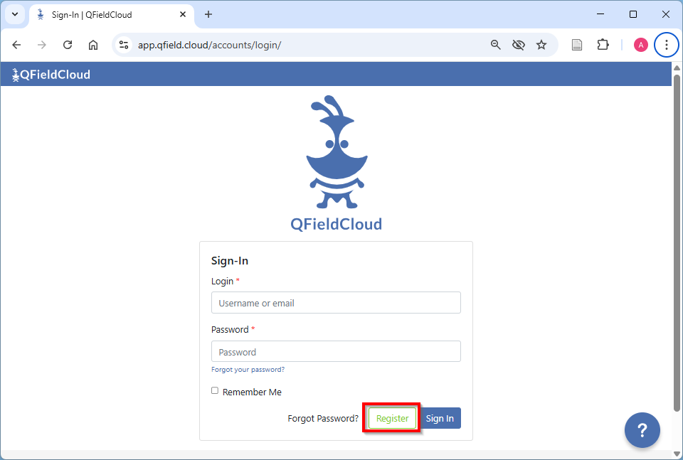
```

### Fyll ut feltene for å opprette brukernavn, passord, osv. Klikk til slutt på `Register` for å opprette konto

```{r index216, echo=FALSE}
knitr::include_graphics("images/cloud19.png")
```

## Installer QFieldSync

Åpne QGIS og sørg for at du har tilgang på internett. Dette er nødvendig for å laste ned programtillegget.

### Gå til `Plugins` i menylinjen og klikk på `Manage and Install Plugins...`

```{r index217, echo=FALSE}
knitr::include_graphics("images/install_plugin_1.png")
```

Det vil dukke opp et vindu.

### Installer programtillegget

A. Søk etter "QFieldSync" i søkefeltet\
B. Klikk på `QFieldSync`\
C. Klikk på `Install Plugin`

```{r index218, echo=FALSE}
knitr::include_graphics("images/cloud5.png")
```

Ikonene for QFieldSync vil nå dukke opp i verktøymenyen.

```{r index219, echo=FALSE}
knitr::include_graphics("images/cloud6.png")
```

## Legg inn prosjekt i QFieldCloud {#import-qfieldcloud}

### Klikk på ikonet for `QFieldCloud Projects Overview`

```{r index220, echo=FALSE, out.width='30pt', out.height='30pt'}
knitr::include_graphics("images/cloud7.png")
```

### Logg inn med QFieldCloud

A. Fyll inn brukernavn og passord\
B. Klikk på `Sign In`

```{r index221, echo=FALSE}
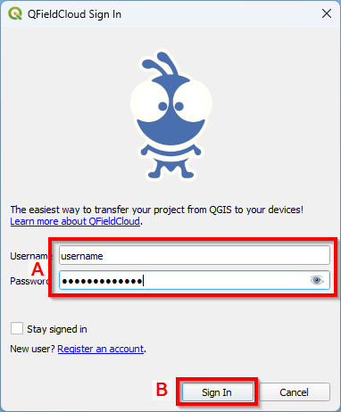
```

### Klikk på ikonet `Start New Project`

```{r index222, echo=FALSE}
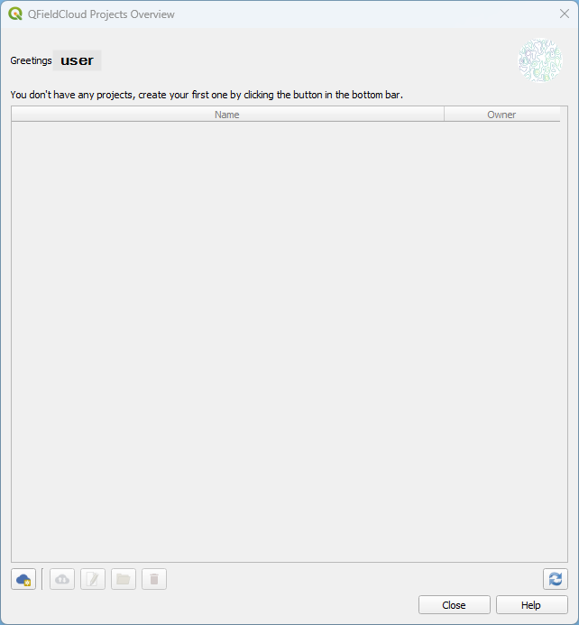
```

### Opprett et midlertidig passord

A. Fyll inn midlertidig passord\
B. Klikk på `Ok`

```{r index223, echo=FALSE}
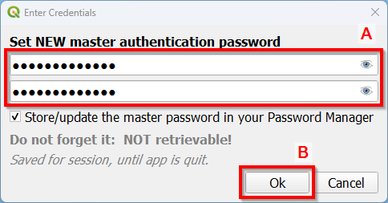
```

### Velg innstillinger

A. Huk av for `Convert currently open project to cloud project`\
B. Klikk på `Next`

```{r index224, echo=FALSE}
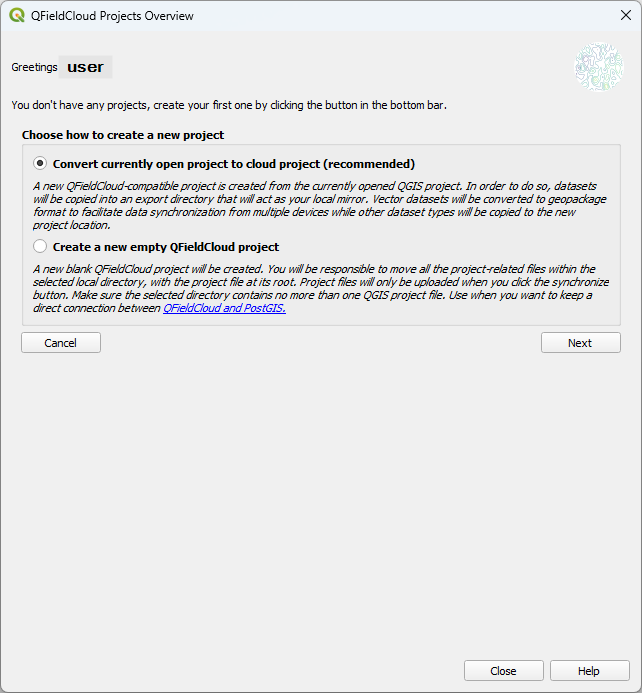
```

### Velg prosjektnavn og filplassering

A. Fyll inn prosjektnavn\
B. Beskriv prosjektet kort\
C. Angi ønsket filplassering

```{r index225, echo=FALSE}
knitr::include_graphics("images/cloud13.png")
```

### Klikk på `Create`

```{r index226, echo=FALSE}
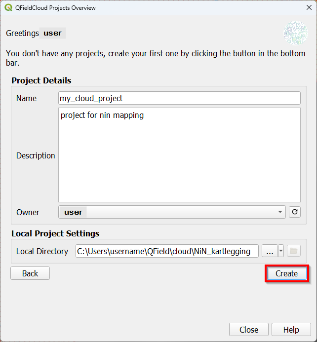
```

### Klikk på `OK`

```{r index227, echo=FALSE}
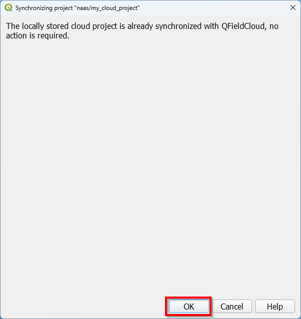
```

```{r index228, echo=FALSE}
knitr::include_graphics("images/cloud16.png")
```

Prosjektet vil nå være eksportert til QFieldCloud og det kan nå åpnes på den nye enheten.

## Importer prosjektet gjennom QFieldCloud

Før du kan importere prosjektet i QGIS må du sørge for at endringene som er gjort i QField, er lastet opp til QFieldCloud (se \@ref(import-qfieldcloud) [Legg inn prosjekt i QFieldCloud](#import-qfieldcloud)). Import av prosjektet til QGIS er kun mulig med internett-tilgang.

### Klikk på ikonet for QFieldCloud Projects Overview

```{r index229, echo=FALSE, out.width='30pt', out.height='30pt'}
knitr::include_graphics("images/cloud7.png")
```

### Logg inn med QFieldCloud

A. Fyll inn brukernavn og passord\
B. Klikk på `Sign In`

```{r index230, echo=FALSE}

```

### Klikk på prosjektet (my_cloud_project)

```{r index231, echo=FALSE}

```

### Klikk på `Synchronize Selected Cloud Project`

```{r index232, echo=FALSE}
knitr::include_graphics("images/import_cloud2.png")
```

Det vil nå dukke opp et nytt vindu.

### Klikk på `Prefer Cloud`

```{r index233, echo=FALSE}
knitr::include_graphics("images/import_cloud7.png")
```

### Klikk på `Perform Actions`

```{r index234, echo=FALSE}
knitr::include_graphics("images/import_cloud8.png")
```

### Klikk på `OK`

```{r index235, echo=FALSE}

```

Prosjektet vil nå bli lastet ned fra skya og bli åpnet i QGIS.

::: {style="display: flex; justify-content: space-between; margin-top: 3em;"}
<div> ← <a href="oppsett-og-tilrettelegging.html">Gå til forrige kapittel</a> </div>
<div> <a href="kartlegging.html">Gå til neste kapittel</a> → </div>
:::
'
} `
