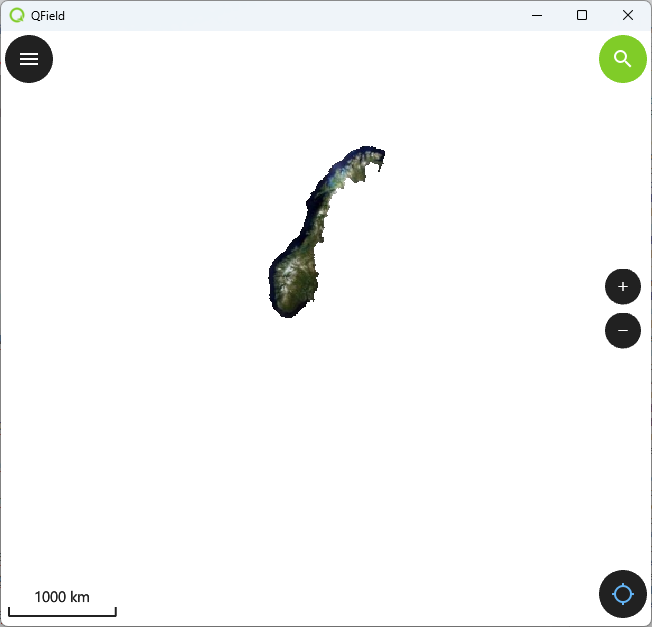
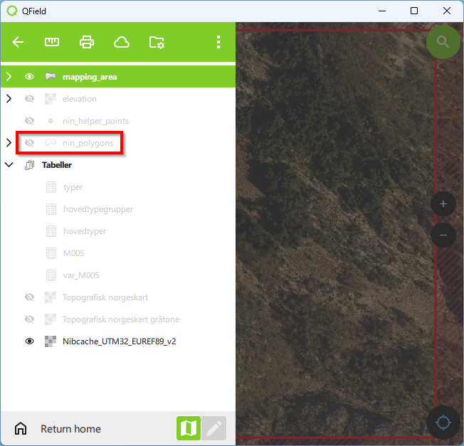
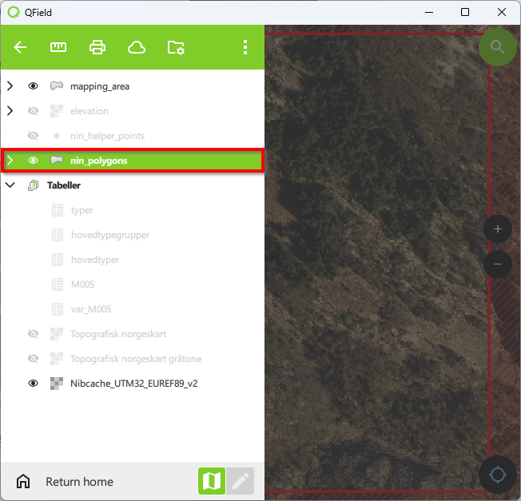
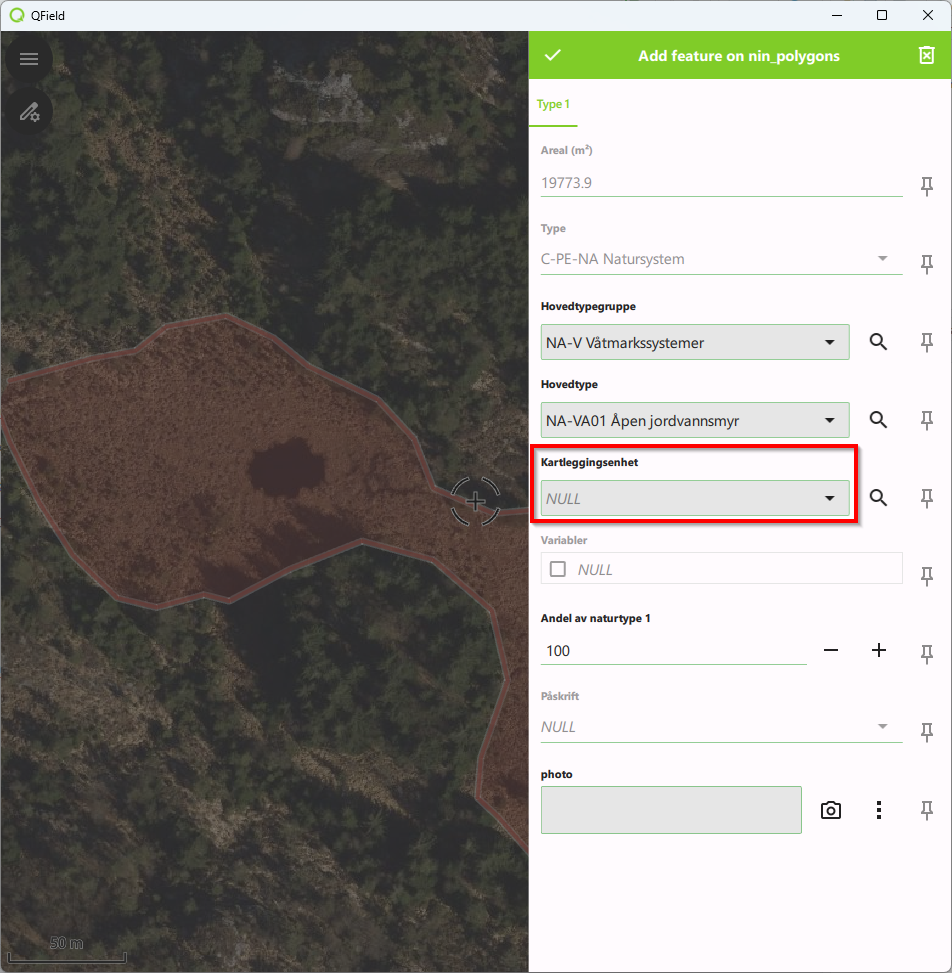
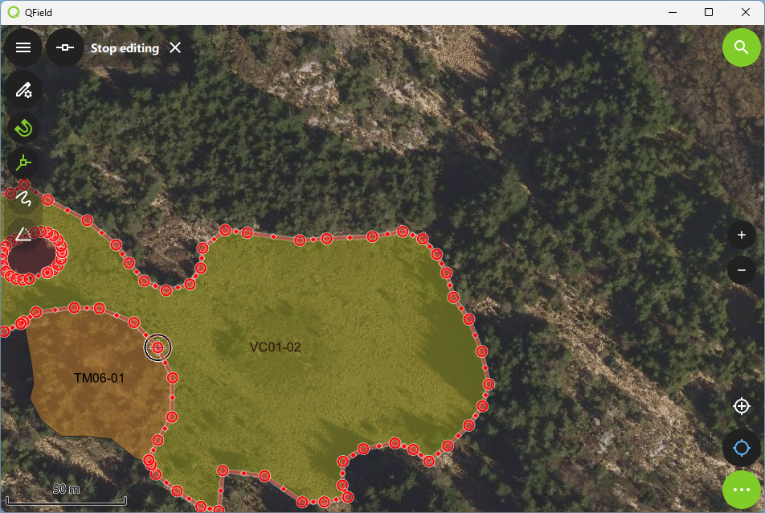
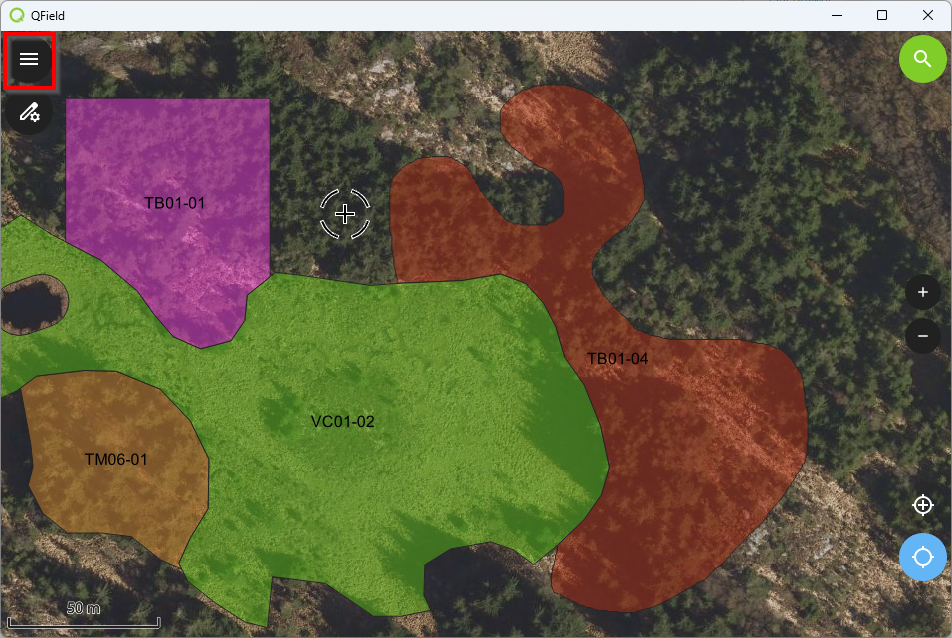
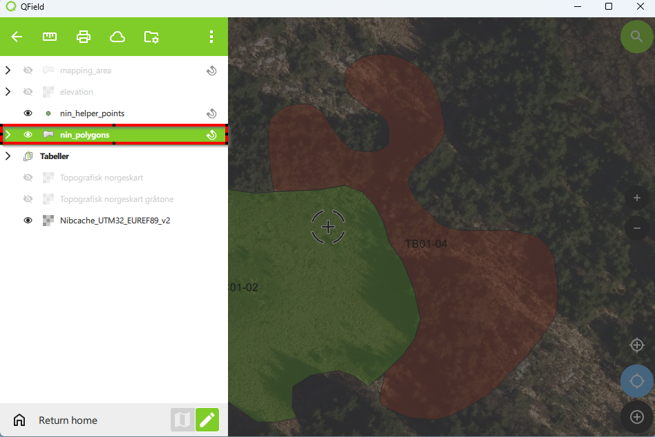

# Kartlegging {#kartlegging}

I denne delen viser vi hvordan man kan bruke QField for kartlegging i prosjekter som er opprettet med programtillegget Natur i Norge kartlegging. Det er også mulig å bruke QGIS for feltkartlegging. Dersom du trenger veiledningsmateriale for kartlegging i QGIS, kan du klikke på [denne lenken](https://docs.qgis.org/3.40/en/docs/user_manual/working_with_vector/index.html).

## Åpne prosjekt i QField

Åpne QField. Det finnes to måter man kan åpne prosjekter i QField. I denne veiledningen viser vi hvordan prosjektet kan åpnes via den lokale harddisken.

### Åpne prosjekt på lokal disk

#### Klikk på `Open local file`

#### Naviger til mappen hvor du har lagret prosjektet (Imported projects/NiN_kartlegging)


```{r index1, echo=FALSE}
knitr::include_graphics("images/open_project_qfield.png")
```


Her vil du se prosjekter (under `Projects`) og datasett (under `Datsets`) som er lagret i mappen.

#### Klikk på `NiN_kartlegging` under `Projects` for å åpne prosjektet


```{r index2, echo=FALSE}
knitr::include_graphics("images/open_project.png")
```


### Åpne prosjekt via QFieldCloud

### Klikk på `QFieldCloud projects`


```{r index3, echo=FALSE}
knitr::include_graphics("images/cloud22.png")
```


### Fyll inn brukernavn og passord


```{r index4, echo=FALSE}

```


### Klikk på `Sign in`


```{r index5, echo=FALSE}

```


### Klikk på prosjektet for å laste det opp lokalt


```{r index6, echo=FALSE}

```


Vent til prosjektet er lastet opp. Du vil få en melding om at prosjektet er klart for å åpnes.

### Klikk på prosjektet for å åpne det


```{r index7, echo=FALSE}
knitr::include_graphics("images/open_project_qfield_3.png")
```


## Kartvinduet

Du vil nå se følgende på skjermen:

**A. Kartvinduet**\
Her kan du utforske kartlagene ved å navigere, zoome og redigere

**B. Menyknapp**\
Ved å klikke på denne kan du skru på redigering, synligjøre, endre på gjennomsiktighet, zomme til kartlag, velge kartlag som skal være aktive


```{r index8, echo=FALSE}
knitr::include_graphics("images/map_area_qfield.png")
```


## Synliggjøre kartlag

### Klikk på menyknappen (B i utsnittet ovenfor)

### Klikk på øyesymbolet ved siden av kartlaget du ønsker å synliggjøre (f.eks. Nibcache_UTM32_EUREF89_v2)


```{r index9, echo=FALSE}
knitr::include_graphics("images/layer_visibility.png")
```


Kartlaget er nå synliggjort, indikert med at øyesymbolet ved siden av kartlaget er markert.


```{r index10, echo=FALSE}

```


Om kartlaget ikke dukker opp i kartvinduet kan det være fordi du ikke har navigert til området hvor kartlaget befinner seg. Dette kan du gjøre ved å bruke funksjonen for å zoome til kartlag.

## Zoome til kartlag

### Langklikk på kartlaget du ønsker å zoome til


```{r index11, echo=FALSE}

```


### Klikk på `Zoom to layer` for å fokusere på området kartlaget befinner seg


```{r index12, echo=FALSE}

```


Kartlaget skal nå kunne ses i kartvinduet. Du vil nå lære hvordan du kan zoome og navigere i kartvinduet.


```{r index13, echo=FALSE}

```


## Zoom

Det er mulig å zoome ved å bruke to fingre på berøringsskjermen eller ved å bruke zoomeknappene i kartvinduet.

### Zoom ved å bruke zoomeknappene. **`+`** brukes for å zoome inn og **`-`** brukes for å zoome ut


```{r index14, echo=FALSE}
knitr::include_graphics("images/zoom.png")
```


### Zoom ved å bruke to fingre på berøringsskjermen. Hold den ene fingeren på skjermen mens du skyver den andre inn mot eller vekk fra den første

## Naviger

### Klikk og skyv digitaliseringspennen i motsatt retning av den retningen du ønsker å flytte kartvinduet

Du vil nå lære hvordan du kan redigere kartlag. Vi har zoomet inn på kartleggingsområdet for å vise dette.

## Redigere kartlag

### Synliggjør kartlaget på samme måte som vist i del

#### Klikk på menyknappen

#### Langklikk på kartlaget (f.eks. nin_polygons som brukes til kartlegging)


```{r index15, echo=FALSE}

```


#### Huk av `Show on map` for å synliggjøre kartlaget


```{r index16, echo=FALSE}
knitr::include_graphics("images/polygon_visibility2.png")
```
Kartlaget har ingen registrerte polygoner og det vil derfor ikke skje noe i kartvinduet ennå.

### Slå på redigeringsmodus {#redigeringsmodus}

#### Klikk på kartlaget du ønsker å redigere (f.eks. nin_polygons) slik at knappen lyser grønt


```{r index17, echo=FALSE}

```


#### Klikk på symbolet med redigeringspennen for å slå på redigeringsmodus

Symbolet vil nå lyse opp i grønt. Hvis du vil avslutte redigeringsmodus, kan du klikke på symbolet igjen.


```{r index18, echo=FALSE, out.width='60pt', out.height='30pt'}

```


#### Klikk på tilbakepila for å gå tilbake til kartvinduet


```{r index19, echo=FALSE}
knitr::include_graphics("images/digitise.png")
```


### Utfigurer ny polygon

#### Klikk i kartvinduet for å lage et hjørnepunkt for polygonen. For å lage et hjørnepunkt må du unngå å flytte digitaliseringspennen samtidig som du holder den inne

#### Når du utfigurerer en polygon og du oppretter en hjørnekoordinat ved en feil har du muligheten til å angre ved å klikke på **`-`**


```{r index20, echo=FALSE}
knitr::include_graphics("images/digitise3.png")
```


```{r index21, echo=FALSE}
knitr::include_graphics("images/digitise4.png")
```


#### Klikk på **`X`** for å forkaste polygonen og avbryte utfigureringen


```{r index22, echo=FALSE}
knitr::include_graphics("images/digitise5.png")
```


#### Utfigurer polygonen ved å lage alle ønskede hjørnepunkter. Pass på å unngå topologifeil (se \@ref(kvalitetssikring) [Kvalitetssikring](#kvalitetssikring))

#### Klikk på den grønne haken når polygonen er utfigurert


```{r index23, echo=FALSE}
knitr::include_graphics("images/digitise2.png")
```


Det vil nå dukke opp et registreringsskjema for å velge polygonens attributter.

### Registrer polygon

#### Registreringsskjemaet

I registreringsskjemaet kan du velge hovedtypegruppe, hovedtype, kartleggingsenhet og hvor mye av polygonen som utgjøres av den registrerte kartleggingsenheten. Du kan også legge til eller ta et foto. Registreringsskjemaet inneholder også informasjon om polygonens areal, typesystem, variabler, og polygonens påskrift som ikke kan redigeres.


```{r index24, echo=FALSE}
knitr::include_graphics("images/attribute_table.png")
```


#### Minsteareal og minstebredde

Dersom polygonen har et mindre areal enn det som er anbefalt i kartleggingsveilederen for den valgte kartleggingsmålestokken vil det dukke opp en advarsel i feltet `Areal`. Det vil også dukke opp oransj tekst med påskriften `Expression constraint`. Merk at dette bare er en advarsel, og at det likevel er mulig å utfigurere polygoner under minstearealet.


```{r index25, echo=FALSE}
knitr::include_graphics("images/attribute_table.png")
```


```{r index26, echo=FALSE}
knitr::include_graphics("images/minimum_mapping_unit.png")
```


Det finnes også retningslinjer for anbefalt minstebredde for polygoner. Det vil ikke dukke opp noen advarsel om en utfigurert polygon er smalere enn dette. For å beregne tykkelsen på polygoner må man derfor bruke målestokken i kartvinduet eller andre hjelpemidler. Her er en oversikt over anbefalt minsteareal og minstebredde i ulike kartleggingsmålestokker og for ulike hovedtypegrupper:


```{r index27, echo=FALSE}
knitr::include_graphics("images/mapping_guidelines3.png")
```


#### Klikk på nedtrekksmenyen for å velge hovedtypegruppe


```{r index28, echo=FALSE}
knitr::include_graphics("images/select_major_type_group2.png")
```


#### Velg hovedtypegruppen som du vil registrere polygonen som


```{r index29, echo=FALSE}

```


Her kan du velge mellom hovedtypegruppene som du valgte når du opprettet prosjektet.

#### Klikk på nedtrekksmenyen for å velge hovedtype


```{r index30, echo=FALSE}
knitr::include_graphics("images/select_major_type.png")
```


#### Velg hovedtypen som du ønsker å registrere polygonen som


```{r index31, echo=FALSE}

```


#### Klikk på nedtrekksmenyen for å velge kartleggingsenhet


```{r index32, echo=FALSE}

```


#### Velg kartleggingsengheten som du ønsker å registrere polygonen som


```{r index33, echo=FALSE}
knitr::include_graphics("images/select_mapping_unit2.png")
```


**Følgende informasjon vil nå vises i registreringsskjemaet:**\
A. Kartleggingsenhetens plassering langs relevante lokale miljøgradienter\
B. Påskriften som vil brukes til å merke polygonen


```{r index34, echo=FALSE}

```


Merk at tilsvarende informasjon oppgis i NiN-feltveilederen.


```{r index35, echo=FALSE}
knitr::include_graphics("images/mapping_guidelines2.png")
```


#### Klikk i feltet for å registrere hvor mye av polygonen som dekkes av den valgte naturtypen


```{r index36, echo=FALSE}
knitr::include_graphics("images/proportion.png")
```


Bruk **`+`** og **`-`** ved siden av feltet for å endre andelen med 10 %. Merk at kartleggingsenheten som registreres må dekke minst 50 % av arealet.

#### Ta bilde med enhetens kamera

##### Klikk på kameraikonet


```{r index37, echo=FALSE}
knitr::include_graphics("images/take_photo.png")
```


##### Klikk på sirkelen med hvitt fyll for å ta bilde 


```{r index38, echo=FALSE}

```


#### Legg ved fil (f.eks. bilde)

##### Klikk på `...` nedenfor photo


```{r index39, echo=FALSE}

```


##### Naviger til mappen hvor du har lagret bildet

##### Klikk på bildefilen du vil legge ved

##### Klikk på `Open`


```{r index40, echo=FALSE}
knitr::include_graphics("images/select_photo.png")
```


#### Registrer ekstra kartleggingsenhet(er)

Dersom kartleggingsenheten dekker mindre enn 100 % av polygonens areal, må du registrere minst én ekstra kartleggingsenhet som dekker restarealet. Altså må kartleggingsenheten(e) dekke til sammen 100 % av arealet.

##### Klikk på `Type 2` for å registrere en ekstra kartleggingsenhet


```{r index41, echo=FALSE}

```


##### Klikk på `False` under sammensatt for å velge at polygonen skal representeres som en sammensatt polygon


```{r index42, echo=FALSE}
knitr::include_graphics("images/mosaic2.png")
```


##### Klikk på `False` under mosaikk for å velge at polygonen skal representeres som en mosaikkpolygon


```{r index43, echo=FALSE}

```


```{r index44, echo=FALSE}

```


Velg enten sammensatt eller mosaikk for polygonen. Det kan du gjøre ved å klikke enda en gang på én av boksene.

##### Velg hovedtypegruppe, hovedtype, kartleggingsenhet og andel av polygonen som dekkes av kartleggingsenheten for kartleggingsenhet 2 som vist ovenfor


```{r index45, echo=FALSE}
knitr::include_graphics("images/mosaic9.png")
```


Hvis det gjenstår 20 % eller mer areal etter at kartleggingsenhet 1 og kartleggingsenhet 2 er registrert, må det legges til en tredje kartleggingsenhet på samme måte som for kartleggingsenhet 2. Merk igjen at alle de registrerte kartleggingsenhetene må dekke til sammen 100 %. Altså vil kartleggingsenheter som dekker mindre enn 20 %, ikke bli registrert.

##### Klikk på den hvite haken for å registrere polygonen


```{r index46, echo=FALSE}
knitr::include_graphics("images/mosaic5.png")
```


Polygonen vil nå være registrert i kartlaget.

### Angre

Vi vil nå vise hvordan man angrer forrige redigering. Vi utfigurerer en ny polygon for å demonstrere.


```{r index47, echo=FALSE}

```
 
```{r index48, echo=FALSE}
knitr::include_graphics("images/undo1.png")
```


#### Klikk på menyknappen


```{r index49, echo=FALSE}
knitr::include_graphics("images/undo2.png")
```


#### Klikk på `...`


```{r index50, echo=FALSE}
knitr::include_graphics("images/undo3.png")
```


#### Klikk på `Undo` for å angre forrige redigering


```{r index51, echo=FALSE}

```


```{r index52, echo=FALSE}
knitr::include_graphics("images/undo5.png")
```


Forrige redigering vil nå være angret.

### Gjøre om igjen

#### Klikk på menyknappen


```{r index53, echo=FALSE}

```


#### Klikk på `...`


```{r index54, echo=FALSE}
knitr::include_graphics("images/redo2.png")
```


#### Klikk på `Redo` for å gjøre redigeringen om igjen


```{r index55, echo=FALSE}
knitr::include_graphics("images/redo3.png")
```


```{r index56, echo=FALSE}

```


Redigeringen vil nå bli gjort om igjen.

### Utfigurer og registrer nye polygoner

For å forhindre overlappende polygoner vil nye polygoner som utfigureres, automatisk klippes mot de eksisterende polygonene. Du kan derfor trygt opprette hjørnekoordinater innenfor en allerede eksisterende polygon. Det samme vil skje om du utfigurerer en polygon rundt en annen.


```{r index57, echo=FALSE}
knitr::include_graphics("images/neighbour_polygon.png")
```


```{r index58, echo=FALSE}

```


### Rediger utfigurering til eksisterende polygoner

#### Redigere hjørnekoordinater {#redigere-hjørnekoordinater}

##### Langklikk på en polygon du vil redigere

Den markerte polygonen vil nå lyse gult.

##### Klikk på polygonens ID nedenfor `nin_polygons`


```{r index59, echo=FALSE}

```


##### Klikk på symbolet for å endre utfigurering


```{r index60, echo=FALSE}

```


##### Klikk på `...` for å velge endringsverktøy


```{r index61, echo=FALSE}
knitr::include_graphics("images/edit_polygon3.png")
```


##### Klikk på symbolet for verktøyet for å redigere hjørnekoordinater


```{r index62, echo=FALSE}
knitr::include_graphics("images/edit_polygon4.png")
```


##### Klikk på en hjørnekoordinat for å endre dens posisjon


```{r index63, echo=FALSE}
knitr::include_graphics("images/edit_polygon5.png")
```


##### Flytt digitaliseringspennen dit du vil flytte hjørnekoordinaten


```{r index64, echo=FALSE}
knitr::include_graphics("images/edit_polygon6.png")
```


##### Klikk igjen når du har flyttet digitaliseringspennen til den ønskede posisjonen


```{r index65, echo=FALSE}

```


##### Klikk på en firkant midt mellom to hjørnekoordinater for å opprette en ny hjørnekoordinat


```{r index66, echo=FALSE}

```


##### Flytt digitaliseringspennen dit du vil at hjørnekoordinaten skal opprettes


```{r index67, echo=FALSE}

```


##### Klikk igjen når du har flyttet digitaliseringspennen dit du vil at hjørnekoordinaten skal opprettes


```{r index68, echo=FALSE}
knitr::include_graphics("images/edit_polygon10.png")
```


##### Angre eller trekke tilbake endringer av hjørnekoordinater

A. Klikk på **`←`** for å angre forrige oppretting eller endring av hjørnekoordinat\
B. Klikk på **`X`** for trekke tilbake alle endringene


```{r index69, echo=FALSE}

```


##### Klikk på den grønne haken for å godta endringene


```{r index70, echo=FALSE}

```


```{r index71, echo=FALSE}
knitr::include_graphics("images/edit_polygon13.png")
```


Du vil nå se at polygongrensene har endret seg.

#### Splitte polygon

##### Langklikk på en polygon du vil redigere

Den markerte polygonen vil nå lyse gult.

##### Klikk på polygonens ID nedenfor `nin_polygons`


```{r index72, echo=FALSE}

```


##### Klikk på symbolet for å endre utfigurering


```{r index73, echo=FALSE}

```


##### Klikk på `...` for å velge endringsverktøy


```{r index74, echo=FALSE}
knitr::include_graphics("images/edit_polygon3.png")
```


##### Klikk på symbolet for verktøyet for å splitte polygoner


```{r index75, echo=FALSE}

```


##### Splitt polygonen ved å opprette hjørnekoordinater gjennom polygonen. Det første og siste klikket må være på utsiden av polygonen du ønsker å splitte


```{r index76, echo=FALSE}
knitr::include_graphics("images/split_polygon2.png")
```


```{r index77, echo=FALSE}

```
\

##### Klikk på den grønne haken for å godta splittingen


```{r index78, echo=FALSE}

```


```{r index79, echo=FALSE}

```


Polygonen vil nå være splittet. Begge polygonene vil tilegnes attributter fra kildepolygonen. (Se \@ref(rediger-attributter) [Rediger attributter for eksisterende polygoner](#rediger-attributter)) for veiledning i å redigere attributtene til en polygon.

#### Formforandringsverktøyet

##### Langklikk en polygon du vil redigere

Den markerte polygonen vil nå lyse gult.

##### Klikk på polygonens ID nedenfor `nin_polygons`


```{r index80, echo=FALSE}

```


##### Klikk på symbolet for å endre utfigurering


```{r index81, echo=FALSE}

```


##### Klikk på `...` for å velge endringsverktøy


```{r index82, echo=FALSE}
knitr::include_graphics("images/edit_shape2.png")
```


##### Klikk på symbolet for verktøyet for å redigere form


```{r index83, echo=FALSE}
knitr::include_graphics("images/edit_shape.png")
```


##### Fjerne deler av polygonen ved å opprette hjørnekoordinater gjennom polygonen. Det første og siste klikket må være på utsiden av polygonen du ønsker å fjerne deler av


```{r index84, echo=FALSE}
knitr::include_graphics("images/edit_shape3.png")
```


```{r index85, echo=FALSE}

```


##### Klikk på den grønne haken for å godta splittingen


```{r index86, echo=FALSE}
knitr::include_graphics("images/edit_shape5.png")
```


```{r index87, echo=FALSE}

```


Deler av polygonen vil nå være fjernet.

#### Utviskingsverktøy

##### Langklikk på en polygon du vil redigere

Den markerte polygonen vil nå lyse gult.

##### Klikk på polygonens ID nedenfor `nin_polygons`


```{r index88, echo=FALSE}
knitr::include_graphics("images/erase.png")
```


##### Klikk på symbolet for å endre utfigurering


```{r index89, echo=FALSE}

```


##### Klikk på `...` for å velge endringsverktøy


```{r index90, echo=FALSE}
knitr::include_graphics("images/erase3.png")
```


##### Klikk på symbolet for viskeverktøyet


```{r index91, echo=FALSE}
knitr::include_graphics("images/erase4.png")
```


##### Klikk på symbolet nede i høyre hjørne for å endre tykkelsen på viskelæret


```{r index92, echo=FALSE}

```


##### Klikk inni polygonen for å viske ut deler av polygonen


```{r index93, echo=FALSE}

```


```{r index94, echo=FALSE}
knitr::include_graphics("images/erase7.png")
```


##### Klikk på den grønne haken for å godta utviskingen


```{r index95, echo=FALSE}
knitr::include_graphics("images/erase8.png")
```


Deler av polygonen vil nå være fjernet. Hvis du ønsker at det nyopprette hullet skal ha en annen form (enn ellliptisk) kan du endre på hjørnekoordinater etter å ha brukt utviskingsverktøyet. (Se \@ref(redigere-hjørnekoordinater) [Redigere hjørnekoordinater](#redigere-hjørnekoordinater)) for veiledning i redigering av hjørnekoordinater.

#### Ringfyllingsverktøyet

##### Langklikk på en polygon du vil redigere

Den markerte polygonen vil nå lyse gult.

##### Klikk på polygonens ID nedenfor `nin_polygons`


```{r index96, echo=FALSE}
knitr::include_graphics("images/fill_ring.png")
```


##### Klikk på symbolet for å endre utfigurering


```{r index97, echo=FALSE}
knitr::include_graphics("images/fill_ring2.png")
```


##### Klikk på `...` for å velge endringsverktøy


```{r index98, echo=FALSE}
knitr::include_graphics("images/fill_ring3.png")
```


##### Klikk på symbolet for verktøyet for å lage polygoner inni andre polygoner


```{r index99, echo=FALSE}

```


##### Lag en polygon på innsiden av en annen ved å opprette hjørnekoordinater inni polygonen


```{r index100, echo=FALSE}
knitr::include_graphics("images/fill_ring5.png")
```


```{r index101, echo=FALSE}

```


##### Klikk på den grønne haken for å godta polygonen


```{r index102, echo=FALSE}

```


##### Klikk `Yes` i vinduet som dukker opp for å godta polygonen


```{r index103, echo=FALSE}

```


##### Fyll ut registreringsskjema som vist i del `...` Registreringsskjema for å opprette polygonen


```{r index104, echo=FALSE}
knitr::include_graphics("images/fill_ring9.png")
```


```{r index105, echo=FALSE}
knitr::include_graphics("images/fill_ring10.png")
```


Den nye polygonen vil dukke opp.

#### Klikk på `Stop editing` for å stoppe redigering


```{r index106, echo=FALSE}
knitr::include_graphics("images/stop_editing.png")
```


### Rediger attributter for eksisterende polygoner {#rediger-attributter}

#### Langklikk på en polygon du vil redigere

Den markerte polygonen vil nå lyse gult. Etter splitting av polygon vil den splittede polygonen få samme ID som kildepolygonene. Etter redigering derimot, vil den nyopprettede polygonen få en ny ID.

#### Klikk på polygonens ID nedenfor `nin_polygons`


```{r index107, echo=FALSE}
knitr::include_graphics("images/edit_attribute.png")
```


#### Klikk på symbolet for å endre attributter


```{r index108, echo=FALSE}
knitr::include_graphics("images/edit_attribute2.png")
```


#### Endre attributter som vist i del `...` Registreringsskjema og klikk på den hvite haken for å godta endringene


```{r index109, echo=FALSE}
knitr::include_graphics("images/edit_attribute3.png")
```


#### Klikk på tilbakepila for å gå ut av attributtendringsmodusen


```{r index110, echo=FALSE}
knitr::include_graphics("images/edit_attribute4.png")
```


#### Klikk på tilbakepila for å gå ut av redigeringsmodus


```{r index111, echo=FALSE}
knitr::include_graphics("images/edit_attribute5.png")
```
 
```{r index112, echo=FALSE}

```


Polygonens attributter vil nå være endret.

### Slette polygoner

#### Langklikk på en polygon du vil slette

Den markerte polygonen vil nå lyse gult.

#### Klikk på `...`


```{r index113, echo=FALSE}

```


#### Klikk på `Toggle Feature Selection` for å velge polygonen som skal slettes


```{r index114, echo=FALSE}
knitr::include_graphics("images/delete_polygon3.png")
```


#### Klikk på ID til polygonen du vil slette


```{r index115, echo=FALSE}
knitr::include_graphics("images/delete_polygon4.png")
```


#### Klikk på `...`


```{r index116, echo=FALSE}
knitr::include_graphics("images/delete_polygon5.png")
```


#### Klikk på `Delete Selected Feature(s)` for å slette polygonen


```{r index117, echo=FALSE}
knitr::include_graphics("images/delete_polygon6.png")
```


#### Klikk på `OK` for å slette polygonen


```{r index118, echo=FALSE}
knitr::include_graphics("images/delete_polygon7.png")
```
 
```{r index119, echo=FALSE}

```


Polygonen vil nå være slettet.

### Sammensmelte polygoner

#### Langklikk på grensen mellom polygonene du vil sammensmelte


```{r index120, echo=FALSE}
knitr::include_graphics("images/merge.png")
```


De markerte polygonene vil nå lyse gult.

#### Klikk på `...`


```{r index121, echo=FALSE}
knitr::include_graphics("images/merge2.png")
```


#### Klikk på `Toggle Feature Selection` for å velge polygonene som skal smeltes sammen


```{r index122, echo=FALSE}
knitr::include_graphics("images/merge3.png")
```


#### Klikk på ID til polygonene du vil smelte sammen


```{r index123, echo=FALSE}

```
 
```{r index124, echo=FALSE}
knitr::include_graphics("images/merge5.png")
```


#### Klikk på `...`


```{r index125, echo=FALSE}

```


#### Klikk på `Merge Selected Features` for å sammensmelte polygonene


```{r index126, echo=FALSE}
knitr::include_graphics("images/merge7.png")
```


#### Klikk på `OK` for å smelte den minste polygonen sammen med den største


```{r index127, echo=FALSE}
knitr::include_graphics("images/merge8.png")
```


Polygonene vil nå være smeltet sammen.

#### Klikk på **`X`** for å gå ut av `...`


```{r index128, echo=FALSE}
knitr::include_graphics("images/merge9.png")
```


#### Klikk på **`←`** for å gå ut av listen med polygoner


```{r index129, echo=FALSE}

```
 
```{r index130, echo=FALSE}

```


### Redigeringsinnstillinger

#### Snappefunksjonen


```{r index131, echo=FALSE}
knitr::include_graphics("images/snapping.png")
```


For å unngå hull i kartet vil symbolet som forflytter seg med digitaliseringspennen automatisk trekkes eller snappes mot polygongrensene om du holder digitaliseringspennen i nærheten av en polygongrense. Dette vil vises ved at symbolet som forflytter seg med digitaliseringspennen trekker seg sammen. Det er mulig å slå av snappefunksjonen.

##### Klikk på redigeringsinnstillingsknappen


```{r index132, echo=FALSE}
knitr::include_graphics("images/snapping2.png")
```


##### Klikk på snappesymbolet for å slå funksjonen av (at det lyser grønt betyr at funksjonen er slått på)


```{r index133, echo=FALSE}
knitr::include_graphics("images/snapping3.png")
```


```{r index134, echo=FALSE}
knitr::include_graphics("images/snapping4.png")
```


Dersom du nå prøver å holde digitaliseringspennen i nærheten av en polygongrense vil du legge merke til at symbolet som forflytter seg med den ikke lenger snappes automatisk til polygonen.

#### Topologisk redigering

For å unngå overlapp mellom polygonene i kartet vil polygongrenser bli flyttet sammen om man endrer på hjørnekoordinater som er felles for flere polygoner.


```{r index135, echo=FALSE}

```


```{r index136, echo=FALSE}
knitr::include_graphics("images/topological_editing2.png")
```


```{r index137, echo=FALSE}
knitr::include_graphics("images/topological_editing3.png")
```


Denne funksjonen som kalles topologisk redigering kan slås av.

##### Klikk på redigeringsinnstillingsknappen


```{r index138, echo=FALSE}
knitr::include_graphics("images/topological_editing4.png")
```


##### Klikk på symbolet for topologisk redigering for å slå funksjonen av (at det lyser grønt betyr at funksjonen er slått på)


```{r index139, echo=FALSE}

```


```{r index140, echo=FALSE}

```


```{r index141, echo=FALSE}
knitr::include_graphics("images/topological_editing7.png")
```


```{r index142, echo=FALSE}

```


Dersom du nå prøver å flytte en hjørnekoordinat som er felles for to polygoner vil kun grensen til den ene polygonen flyttes. Legg merke til at kun polygongrensen til én av polygonene ble flyttet.

#### Frihåndstegning

##### Klikk på redigeringsinnstillingsknappen


```{r index143, echo=FALSE}

```


##### Klikk på symbolet for frihåndstegning for å slå funksjonen på (at det lyser grønt betyr at funksjonen er slått på)


```{r index144, echo=FALSE}
knitr::include_graphics("images/free_draw2.png")
```


##### Utfigurer polygoner ved å trykke digitaliseringspennen mot berøringsskjermen mens du drar den over kartvinduet. Ta digitaliseringspennem vekk fra berøringsskjermen når polygonen er ferdig utfigurert


```{r index145, echo=FALSE}
knitr::include_graphics("images/free_draw3.png")
```


```{r index146, echo=FALSE}

```


#### Vinkelrett ufigurering

##### Klikk på redigeringsinnstillingsknappen


```{r index147, echo=FALSE}

```


##### Klikk på symbolet for vinkelrett utfigurering for å slå funksjonen på (at det lyser grønt betyr at funksjonen er slått på)


```{r index148, echo=FALSE}

```


##### Utfigurer polygoner som vanlig. Symbolet som forflytter seg med digitaliseringspennen vil automatisk snappes til nærmest 45 graders vinkel i forhold til forrige hjørnekoordinat og det vil dukke opp en stiplet linje som viser dette


```{r index149, echo=FALSE}

```


```{r index150, echo=FALSE}
knitr::include_graphics("images/delineate_angles4.png")
```


### Slå på GPS og zoom til din posisjon

#### Klikk på navigeringssymbolet for å slå på GPS


```{r index151, echo=FALSE}
knitr::include_graphics("images/gps.png")
```


#### Klikk på navigeringssymbolet igjen for å zoome til din posisjon


```{r index152, echo=FALSE}
knitr::include_graphics("images/gps2.png")
```


```{r index153, echo=FALSE}
knitr::include_graphics("images/gps3.jpg")
```


Du vil nå se posisjonen din som et blått punkt.

### Endre gjennomsiktighet på kartlag

Endre gjennomsiktigheten på kartlagene som ønsket. Dette kan gjøre det enklere å visualisere flere kartlag samtidig.

#### Klikk på menyknappen


```{r index154, echo=FALSE}

```


#### Langklikk på kartlaget du vil endre gjennomsiktigheten til


```{r index155, echo=FALSE}

```


#### Klikk på skyvebaren og dra den til siden for å endre på gjennomsiktigheten til kartlaget


```{r index156, echo=FALSE}
knitr::include_graphics("images/visibility3.png")
```


```{r index157, echo=FALSE}
knitr::include_graphics("images/visibility4.png")
```


```{r index158, echo=FALSE}
knitr::include_graphics("images/visibility5.png")
```


Gjennomsiktigheten på kartlaget vil nå være endret.

### Registrere punkter

Sørg for at redigeringsmodus er på (se \@ref(redigeringsmodus) [Slå på redigeringsmodus](#redigeringsmodus)) og at du redigerer i riktig kartlag.


```{r index159, echo=FALSE}

```


#### Klikk i kartvinduet der du vil registrere et punkt


```{r index160, echo=FALSE}
knitr::include_graphics("images/points2.png")
```


Det vil nå dukke opp et nytt vindu.

#### Klikk på den hvite haken i vinduet for å registrere punktet. I vinduet har du muligheten til å velge punktets attributter


```{r index161, echo=FALSE}

```


```{r index162, echo=FALSE}

```


Et punkt vil nå være opprettet.

### Gå tilbake til hovedmenyen

#### Klikk på menyknappen


```{r index163, echo=FALSE}
knitr::include_graphics("images/return_home.png")
```


#### Klikk på `Return home`


```{r index164, echo=FALSE}
knitr::include_graphics("images/return_home2.png")
```


```{r index165, echo=FALSE}
knitr::include_graphics("images/return_home3.png")
```


Du vil nå se hovedmenyen.

## Overføre registreringer/endringer til QFieldCloud

### Klikk på menyknappen


```{r index166, echo=FALSE}
knitr::include_graphics("images/push.png")
```


Da ser man at skya har fått et siffer på seg. Det betyr at prosjektet på enheten er ulik kopien av prosjektet som ligger i skya. I dette tilfellet er det gjeort en registrering/endring. Denne registreringen skal vi nå overføre til skya.

### Klikk på ikonet for QFieldCloud


```{r index167, echo=FALSE}

```


### Velg handling


```{r index168, echo=FALSE}

```


-   Klikk på `Push changes` for å overføre registreringa til prosjektkopien som ligger i skya. Dermed oppdateres prosjektet i skya slik at prosjektet i skya (QFieldCloud) er lik prosjektet som ligger lagret lokalt på nettbrettet.

-   `Synchronize` vil laste den versjonen av prosjektet som til enhver tid ligger i skya (QFieldCloud) ned til nettbrettet og overskrive eksisterende prosjekt.

-   Klikk på `Revert local changes` for å avbryte endringene som er gjort

`r if (knitr::is_html_output()) {
'
::: {style="display: flex; justify-content: space-between; margin-top: 3em;"}
<div> ← <a href="eksportere-prosjekt.html">Gå til forrige kapittel</a> </div>
<div> <a href="kvalitetssikring.html">Gå til neste kapittel</a> → </div>
:::
'
} `