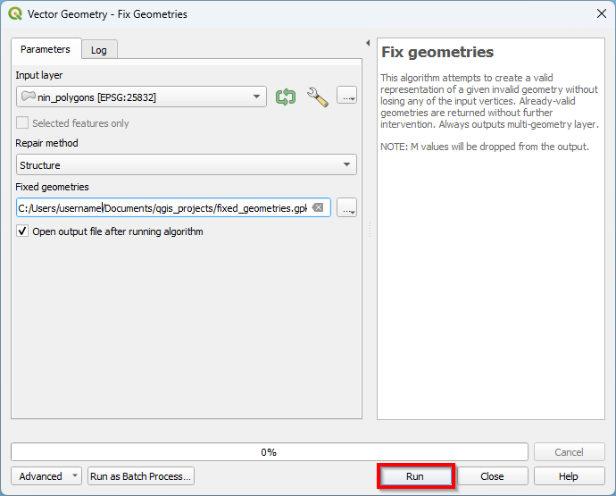

# Kvalitetssikring {#kvalitetssikring}

Under kartlegging kan det oppstå topologifeil når polygonene utfigureres. Dette kan føre til følgefeil om man vil bruke kartet i analyser i etterkant av feltarbeidet. I bildet nedenfor er det vist et utvalg av topologifeil:

A. Overlapp\
B. Invalid geometri\
C. Hull\
D. Geometri med flere deler\
E. Duplisert hjørnekoordinat


```{r index236, echo=FALSE}
knitr::include_graphics("images/quality3.png")
```


## Aktiver Topology Checker

### Gå til `Plugins` i menylinjen og klikk på `Manage and Install Plugins...`


```{r index237, echo=FALSE}
knitr::include_graphics("images/install_plugin_1.png")
```


Det vil dukke opp et vindu.

### Aktiver Topology Checker

A. Søk etter "Topology Checker" i søkefeltet\
B. Huk av `Topology Checker`


```{r index238, echo=FALSE}

```


```{r index239, echo=FALSE}
knitr::include_graphics("images/topology_checker2.png")
```


Programtillegget Topology Checker er nå tilgjengelig i QGIS.

## Finn topologifeil

### Gå til `Vector` i menylinjen og klikk på `Topology Checker`


```{r index240, echo=FALSE}
knitr::include_graphics("images/quality.png")
```


```{r index241, echo=FALSE}

```


Panelet for Topology Checker vil nå dukke opp.

### Klikk på `Topology Rule Settings`


```{r index242, echo=FALSE}
knitr::include_graphics("images/quality4.png")
```


### Velg kartlaget du vil opprette en regel for


```{r index243, echo=FALSE}
knitr::include_graphics("images/quality5.png")
```


### Velg én av kartlagene


```{r index244, echo=FALSE}

```


### Velg hvilken regel du vil opprette


```{r index245, echo=FALSE}
knitr::include_graphics("images/quality7.png")
```


### Velg én av alternativene (f.eks. must not have duplicates)


```{r index246, echo=FALSE}
knitr::include_graphics("images/quality8.png")
```


### Klikk på **`+`** for å legge til regelen


```{r index247, echo=FALSE}

```


```{r index248, echo=FALSE}
knitr::include_graphics("images/quality10.png")
```


Du har nå opprettet en regel som sier at kartlaget ikke skal inneholde duplikater.

### Opprett regler som du ønsker å basere søket ditt på (på samme måte som ovenfor)


```{r index249, echo=FALSE}
knitr::include_graphics("images/quality11.png")
```


**Her har vi valgt å basere søket på at kartlaget ikke skal ha:**

-   Duplikater
-   Hull
-   Invalide geometrier
-   Geometrier bestående av flere atskilte deler
-   Overlappende polygoner

### Klikk på `OK`


```{r index250, echo=FALSE}
knitr::include_graphics("images/quality12.png")
```


### Klikk på `Validate All` for å søke basert på de opprettede reglene


```{r index251, echo=FALSE}
knitr::include_graphics("images/quality13.png")
```


```{r index252, echo=FALSE}
knitr::include_graphics("images/quality14.png")
```


Feilene som ble funnet og hvilken polygon de tilhørerer vil nå dukke opp i panelet.

### Klikk på én av feilene i panelet for å zoome inn mot feilen


```{r index253, echo=FALSE}
knitr::include_graphics("images/fix.png")
```


```{r index254, echo=FALSE}
knitr::include_graphics("images/fix2.png")
```


## Behandle topologifeil

### Behandle overlapp

Vi anbefaler å behandle overlapp mellom polygoner manuelt med Vertex Tool.

### Klikk på kartlaget som har overlappende polygoner


```{r index255, echo=FALSE}

```


### Klikk på `Toggle Editing`


```{r index256, echo=FALSE}

```


### Klikk på `Vertex Tool`


```{r index257, echo=FALSE}
knitr::include_graphics("images/fix5.png")
```


### Endre på hjørnekoordinatene i de overlappende polygonene slik at de ikke overlapper lenger

Dette gjør du ved å endre på gamle hjørnekoordinater eller ved å opprette nye. Gamle hjørnekoordinater vil markeres med en sirkel når du holder musepekeren over dem. Klikk på sirkelen om du vil opprette enn ny hjørnekoordinat. Klikk igjen når du holder musepekeren over den ønskede posisjonen til den nye hjørnekoordinaten. Halvveis mellom to hjørnekoordinater er det mulig å opprette en ny hjørnekoordinat. Det vil dukke opp et kors når du holder musepekeren over. Klikk på korset om du vil opprette enn ny hjørnekoordinat. Klikk igjen når du holder musepekeren over den ønskede posisjonen til den nye hjørnekoordinaten. Musepekeren vil automatisk snappes mot hjørnekoordinater og gjøre det enklere å unnngå hull eller nye overlapp i kartet under denne operasjonen.


```{r index258, echo=FALSE}
knitr::include_graphics("images/fix6.png")
```


#### Klikk på en hjørnekoordinat i den andre polygonen. Musepekeren vil automatisk snappes til hjørnekoordinater


```{r index259, echo=FALSE}

```


#### Opprett nye hjørnekoordinater nær polygongrensen


```{r index260, echo=FALSE}
knitr::include_graphics("images/fix8.png")
```


#### Klikk på en hjørnekoordinat i den andre polygonen


```{r index261, echo=FALSE}
knitr::include_graphics("images/fix9.png")
```


#### Klikk på `Validate All` når du har behandlet overlapp mellom polygonene


```{r index262, echo=FALSE}
knitr::include_graphics("images/fix10.png")
```


```{r index263, echo=FALSE}
knitr::include_graphics("images/fix11.png")
```


Legg merke til at overlappen som ble behandlet er borte fra panelet Vi kan håndtere overlapp mellom andre polygoner på samme måte.

### Behandle invalide geometrier

#### Klikk på `Toolbox`


```{r index264, echo=FALSE}
knitr::include_graphics("images/geom.png")
```


#### Åpne Fix geometries

A. Skriv "Fix Geometries" i søkefeltet\
B. Dobbelklikk på `Fix geometries`


```{r index265, echo=FALSE}
knitr::include_graphics("images/geom2.png")
```


#### Klikk på `...`


```{r index266, echo=FALSE}

```


#### Klikk på `Save to File...`


```{r index267, echo=FALSE}
knitr::include_graphics("images/geom7.png")
```


#### Naviger til mappen du vil lagre det nye polygonlaget i

#### Velg mappe og filnavn for polygonlaget som skal opprettes

A. Skriv inn navn på det nye polygonlaget i `File name:`\
B. Klikk på `Save`


```{r index268, echo=FALSE}
knitr::include_graphics("images/geom4.png")
```


#### Klikk på `Run`

Merk at kartlaget ikke har fått samme stil som det opprinnelige kartlaget. Overskriv stilen i det nye kartlaget ved å kopiere stilen til det opprinnelige kartlaget (se \@ref(endre-stil) [Endre stil ved kopiering og liming](#endre-stil)).


```{r index269, echo=FALSE}

```


```{r index270, echo=FALSE}
knitr::include_graphics("images/geom8.png")
```


Når du igjen klikker på `Validate All` vil du se at det ikke er flere invalide geometrier.

### Behandle geometrier med flere atskilte deler

#### Gå til `Vector` → `Geometry Tools` i menylinjen og klikk på `Multipart to Singleparts...`


```{r index271, echo=FALSE}
knitr::include_graphics("images/geom11.png")
```


#### Klikk på `...`


```{r index272, echo=FALSE}

```


#### Klikk på `Save to File...`


```{r index273, echo=FALSE}
knitr::include_graphics("images/geom13.png")
```


#### Naviger til mappen du vil lagre det nye polgyonlaget i

#### Velg mappe og filnavn for det nye polygonlaget som skal opprettes


```{r index274, echo=FALSE}
knitr::include_graphics("images/geom14.png")
```


#### Klikk på `Run`


```{r index275, echo=FALSE}

```


Merk at kartlaget ikke har fått samme stil som det opprinnelige kartlaget. Overskriv stilen i det nye kartlaget ved å kopiere stilen til det opprinnelige kartlaget (se \@ref(endre-stil) [Endre stil ved kopiering og liming](#endre-stil)).


```{r index276, echo=FALSE}
knitr::include_graphics("images/geom16.png")
```


Når du igjen klikker på `Validate All` vil du se at det ikke er flere geometrier med flere atskilte deler.

### Behandle hull

#### Klikk på kartlaget med hull


```{r index277, echo=FALSE}
knitr::include_graphics("images/geom22.png")
```


#### Klikk på `Toggle Editing`


```{r index278, echo=FALSE}

```


#### Klikk på `Add Polygon Feature`


```{r index279, echo=FALSE}
knitr::include_graphics("images/geom24.png")
```


#### Utfigurer en polygon rundt hullet ved å klikke der du vil opprette hjørnekoordinater. Venstreklikk når polygonen er utfigurert


```{r index280, echo=FALSE}
knitr::include_graphics("images/geom25.png")
```


Det vil dukke opp et registreringsskjema.

#### Klikk på `OK`


```{r index281, echo=FALSE}

```


#### Gå til `View` → `Panels` i menylinjen og klikk på `Advanced Digitizing Panel`


```{r index282, echo=FALSE}
knitr::include_graphics("images/geom28.png")
```


```{r index283, echo=FALSE}
knitr::include_graphics("images/geom29.png")
```


Det vil dukke opp nye ikoner i verktøylinjen.

#### Klikk på ikonet for `Select Features by Area or Single Click`


```{r index284, echo=FALSE}
knitr::include_graphics("images/geom30.png")
```


#### Klikk på polygonen som ble utfigurert i hullet


```{r index285, echo=FALSE}
knitr::include_graphics("images/geom31.png")
```


#### Hold inne `Ctrl` og klikk samtidig på en polygon du ønsker å smelte sammen med polygonen i hullet


```{r index286, echo=FALSE}
knitr::include_graphics("images/geom32.png")
```


#### Klikk på ikonet for `Merge Selected Features`


```{r index287, echo=FALSE}

```


Det vil dukke opp et vindu med attributter for de valgte polygonene.

#### Klikk på polygonen du ønsker å smelte sammen med polygonen i hullet


```{r index288, echo=FALSE}
knitr::include_graphics("images/geom34.png")
```


#### Klikk på ikonet ved siden av `Take attributes from selected feature`


```{r index289, echo=FALSE}
knitr::include_graphics("images/geom35.png")
```


#### Klikk på `OK`


```{r index290, echo=FALSE}
knitr::include_graphics("images/geom36.png")
```


```{r index291, echo=FALSE}
knitr::include_graphics("images/geom37.png")
```


Når du igjen klikker på `Validate All` vil du se at det ikke er flere geometrier med flere atskilte deler.

### Endre stil ved kopiering og liming {#endre-stil}

Det vil ikke være mulig å bruke de samme registreringsskjemaene under utfigurering av nye polygoner uten å tilegne det nye polygonlaget den samme stilen som det opprinnelige kartlaget.

#### Venstreklikk på det opprinnelige kartlaget

#### Gå til `Styles` → `Copy Styles` og klikk på `All Style Categories`


```{r index292, echo=FALSE}
knitr::include_graphics("images/geom20.png")
```


#### Venstreklikk på det nye kartlaget

#### Gå til `Styles` → `Paste Styles` og klikk på `All Style Categories`


```{r index293, echo=FALSE}

```


```{r index294, echo=FALSE}
knitr::include_graphics("images/style.png")
```


Stilen vil nå bli den samme som i det opprinnelige kartlaget.

`r if (knitr::is_html_output()) {
'
::: {style="display: flex; justify-content: space-between; margin-top: 3em;"}
<div> ← <a href="kartlegging.html">Gå til forrige kapittel</a> </div>
<div> <a href="index.html">Gå til forsiden</a> → </div>
:::
'
} `