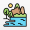
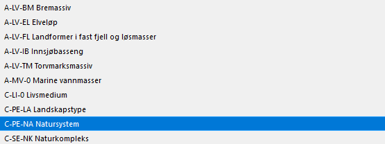
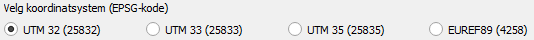
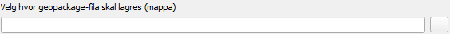
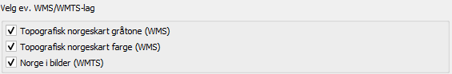
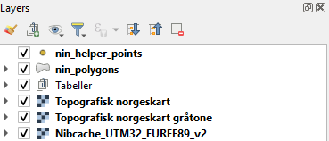
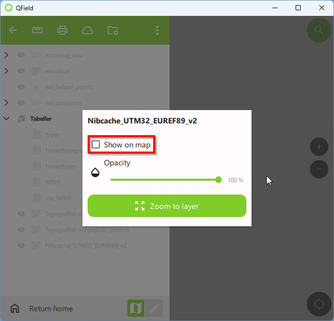

---
---
---

# Oppsett og tilrettelegging av QGIS for NiN naturtypekartlegging

## Innhold

-   [1 Oppsett og tilrettelegging](#oppsett-og-tilrettelegging)
    -   [1.1 Installer Plugin](#installer-plugin)
    -   [Opprett prosjekt](#opprett-prosjekt)
    -   [Tilpass prosjekt](#tilpass-prosjekt)
    -   [Eksportere prosjekt til QField](#eksportere-prosjekt-til-qfield)
-   [2 Kartlegging](#kartlegging)
-   [3 Feilsøking](#feilsøking)

## 1 Oppsett og tilrettelegging {#oppsett-og-tilrettelegging}

Åpne QGIS (versjon 3.34 eller nyere)

### 1.1 Installer Plugin (avhengig av internett-tilkobling)

#### 1.1.1 Gå til Plugins i menylinjen og klikk på Manage and Install Plugins...

#### {width="1306"}

Det vil dukke opp et vindu.

#### 1.1.2 Installer "Natur i Norge kartlegging"

A. Søk etter "Natur i Norge kartlegging" i søkefeltet\
B. Klikk på "Natur i Norge kartlegging"\
C. Klikk på Install Plugin

Ikonet for "Natur i Norge"-kartlegging vil nå dukke opp i verktøymenyen. Lukk installeringsvinduet.

### 1.2 Opprett prosjekt {#opprett-prosjekt}

#### 1.2.1 Klikk på ikonet for "Natur i Norge"-kartlegging

Det vil dukke opp et vindu med flere valgmuligheter.

#### 1.2.2 Velg kategorier som skal være tilgjengelige under kartleggingen

Et prosjekt kan kun inneholde ett typesystem, men det er mulig å velge flere hovedtypegrupper fra samme typesystem. Et prosjekt kan kun inneholde kategorier fra én kartleggingsmålestokk.

##### 1.2.2.1 Klikk på nedtrekksmenyen for å velge typesystem

##### 1.2.2.2 Huk av boks(er) for å velge hovedtypegruppe(r)

##### 1.2.2.3 Klikk på nedtrekksmenyen for å velge kartleggingsmålestokk

#### 1.2.3 Huk av én av boksene for å velge koordinatsystem

Projeksjon av tredimensjonale data på todimensjonale flater vil alltid medføre forvrengninger. Graden av forvrengning varierer mellom ulike områder, avhengig av hvilket koordinatsystem som benyttes. Derfor bør koordinatsystemet velges ut fra hvor kartleggingen skal foregå.

#### 1.2.4 Velg hvor prosjektet skal lagres

##### 1.2.4.1 Klikk på ...

##### 1.2.4.2 Navigér til mappen hvor du ønsker at prosjektet skal lagres

##### 1.2.4.3 Trykk på feltet File name:

##### 1.2.4.4 Skriv inn filnavnet du ønsker at prosjektet skal ha

##### 1.2.4.5 Klikk på Save

Du vil nå se filplasseringen i feltet.

#### 1.2.5 Velg ev. WMS/WMTS-lag

Topografiske kart og flybilder er viktige hjelpemidler under kartlegging. Her kan du velge hvilke(t) kartlag som skal importeres til prosjektet.

#### 1.2.6 Klikk på Lag geopackage-fil og forbered prosjekt nederst i vinduet

#### 

Et prosjekt vil nå opprettes automatisk med det oppgitte filnavnet og filplasseringen. I tillegg vil det opprettes en gpkg-fil med kartlag og tabeller. Prosjektet med gpkg-filen kan igjen åpnes fra denne filplasseringen senere, med mindre gpkg-filen flyttes til et annet område. gpkg-filen inneholder følgende:

**Opprettede kartlag og tabeller:**\
*nin_helper_points* -- punktkartlag for å hjelpe kartleggeren i felt\
*nin_polygons* -- polygonkartlag for å registrere kartleggingsenheter i felt\
*Tabeller* -- tabeller som inneholder typene og variablene som brukes i typesystemene

**Importerte kartlag (avhengig av valgene i vinduet):**\
*Topografisk norgeskart* -- landsdekkende kart med høydekoter og hovedøkosystemer som farger\
*Topografisk norgeskart gråtone* -- landsdekkende kart med høydekoter og hovedøkosystemer i gråtoner\
*Nibcache_UTM32_EUREF89_v2* -- landsdekkende sammenstilte flybilder

#### 1.2.6 Lukk vinduet

### 1.3 Tilpass prosjekt {#tilpass-prosjekt}

1.3.1 Legg til raster

Legg til historisk flybilde eller høydemodell?

1.3.2 Legg til vektor

Legg til område som skal kartlegges

### 1.4 Eksportere prosjekt

### 1.5 Importere prosjekt (QField)

## 2 Kartlegging {#kartlegging}

Åpne QField

### 2.1 Åpne prosjekt

Det finnes to måter man kan åpne prosjekter i QField.

#### 2.1.1 Klikk på Open local file

#### 2.1.2 Navigér til mappen hvor du har lagret prosjektet

#### 2.1.3 Klikk på NiN_kartlegging under Projects for å åpne prosjektet

Du vil nå se følgende på skjermen:

A. Kartvinduet\
B. Menyknapp\
C. Kartmålestokk\
D. Søkefunksjon\
E. Zoomeknapper\
F. Lokaliseringsknapp

#### 

2.2 Slå på GPS

2.2.1 Klikk på lokaliseringsknappen for å slå på GPS

2.2.2 Klikk på lokaliseringsknappen for å navigere til din nåværende posisjon

#### 2.2 Synliggjøre kartlag

2.2.1 Klikk på menyknappen

2.2.2 Høyreklikk på kartlaget du ønsker å synliggjøre (f.eks. Topografisk norgeskart)

Det vil dukke opp et vindu med følgende muligheter:

A. Huk av Show on map for å synliggjøre kartlaget.\
B. Flytt ... langs ... for å endre gjennomsiktigheten til kartlaget. \
C. Klikk på Zoom to layer for å fokusere på området kartlaget befinner seg.

Fokusér på området som skal kartlegges ved å klikke på et kartlag over kartleggingsområdet og klikk på Zoom to layer. Det er også mulig å navigere til området ved å bruke musepekeren og zoomeknappene. Synliggjør og endre gjernnomsiktigheten på kartlagene som ønsket. Dette kan gjøre det enklere å visualisere flere kartlag samtidig.

Du er nå klar for kartlegging.

Åpne prosjekt

Slå på GPS

Begynn å kartlegge

Digitalisering av polygoner

Registrering av kartleggingsenheter

Registreringsskjemaet

## 3 Feilsøking {#feilsøking}

Topologifeil

## Eksportere prosjekt til QGIS
